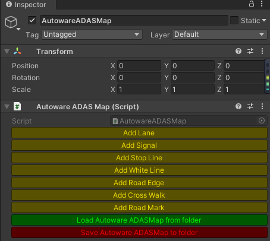
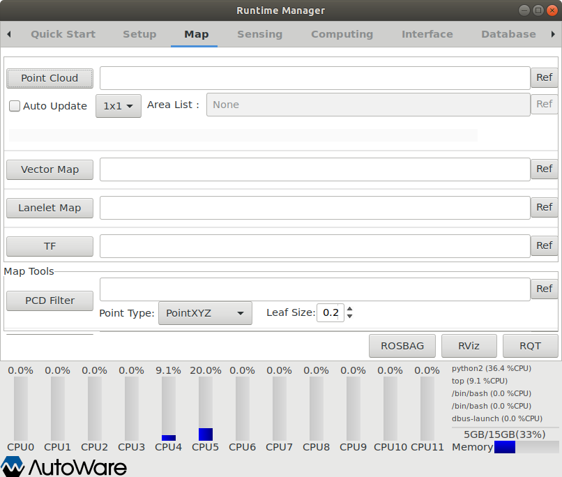

# SLAM地图编辑
### 建图

1. 选择`sensing` 和 `rviz`

2. `file` -> `open config`，选择`.rviz`目录下的`ndt-mapping.rviz`文件

    
    

3. `computing` -> `lidar_localizer/ndt_mapping`,录制地图

    

4. 录制完毕，点击`app`,选择pcd文件路径，点击`PCD OUTPUT`，`CLOSE`

   

### 编辑地图

1. 在windows系统中，浏览器打开[Unity](https://unity.cn/releases/full/2020#548653c6c3de)官网下载2020.3.5版本（先注册账号），选择`从Hub下载`。

   

2. Github下载[Map Toolbox](https://github.com/autocore-ai/MapToolbox/tree/vector_map)，注意选择`vector_map`分支，目录不要有英文
3. 选择`安装`，等待安装完毕。
4. `项目`->`新建`，在新打开的项目窗口中选择`Window`->`Package Manager`，导入下载的`Map Toolbox`中的`package.json`文件，等待加载完毕。
5. 将录制的pcd文件拖到`Assets`->`Scenes`文件夹中，在`Hierarchy`右键选择`Autoware`->`AutowareADASMap`

   

6. 添加白线和车道，编辑完成后点击`Save AutowareADASMap to folder`选项导出地图，传到小车主机中。

   

7. 在`Autoware`->`Map`界面中，分别加载`Point Cloud`和`Vector Map`，点击`tf`和`RViz`可以查看地图。

   
