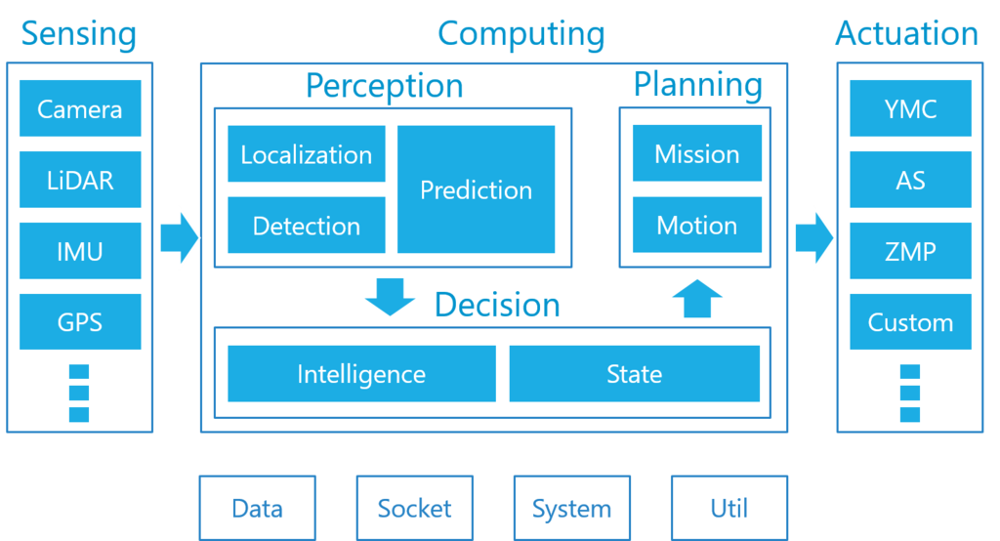

# Tier IV

## 1.简介

Autoware.AI 是 Autoware 的原始版本，由名古屋大学副教授 Shinpei Kato 于 2015 年开发和发布。 同年12月，成立Tier IV，利用Autoware开展自动驾驶业务。 Autoware.AI 基于 ROS1，是为对自动驾驶感兴趣的研究人员创建的开源研发平台。

受到所有人都可以访问的开源生态系统潜力的启发，Tier IV 于 2018 年将 Autoware 的所有权利转让给了 Autoware Foundation (AWF)。 AWF 的创始成员包括合作伙伴公司 Apex.AI 和 Linaro 96 Boards，以及 Tier IV。 

[官方技术博客](https://tier4.jp/media/techblog/)

