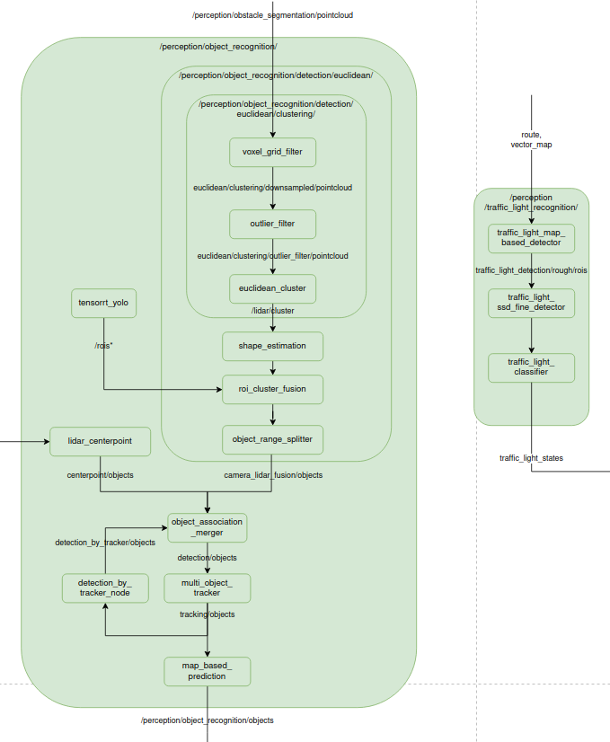

# pkg list

## 1 模块概览

### common

| package name                  | executable                    |
| ----------------------------- | ----------------------------- |
| autoware_auto_algorithm       |                               |
| autoware_auto_common          |                               |
| autoware_auto_geometry        |                               |
| autoware_auto_tf2             |                               |
| covariance_insertion          |                               |
| covariance_insertion_nodes    | covariance_insertion_node_exe |
| had_map_utils                 |                               |
| lidar_utils                   |                               |
| measurement_conversion        |                               |
| monitored_node                |                               |
| motion_model                  |                               |
| mpark_variant_vendor          |                               |
| neural_networks               |                               |
| optimization                  |                               |
| osqp_interface                |                               |
| reference_tracking_controller |                               |
| signal_filters                |                               |
| state_estimation              |                               |
| state_estimation_nodes        | state_estimation_node_exe     |
| state_vector                  |                               |
| time_utils                    |                               |
| tvm_utility                   |                               |
| vehicle_constants_manager     |                               |

### control

| package name                   | executable                                                   |
| ------------------------------ | ------------------------------------------------------------ |
| controller_common              |                                                              |
| controller_common_nodes        |                                                              |
| controller_testing             |                                                              |
| motion_common                  |                                                              |
| motion_model_testing_simulator |                                                              |
| motion_testing                 |                                                              |
| motion_testing_nodes           |                                                              |
| mpc_controller                 |                                                              |
| mpc_controller_nodes           |                                                              |
| pure_pursuit                   |                                                              |
| pure_pursuit_nodes             |                                                              |
| trajectory_follower            |                                                              |
| trajectory_follower_nodes      | lateral_controller_node_exe longitudinal_controller_node_exe latlon_muxer_node |

### drivers

| package name            | executable                                                   |
| ----------------------- | ------------------------------------------------------------ |
| lgsvl_interface         |                                                              |
| lgsvl_simulation        |                                                              |
| ne_raptor_interface     | ne_raptor_interface_node_exe                                 |
| spinnaker_camera_driver |                                                              |
| spinnaker_camera_nodes  | spinnaker_camera_node_exe                                    |
| ssc_interface           | ssc_interface_node_exe                                       |
| vehicle_interface       |                                                              |
| velodyne_driver         |                                                              |
| velodyne_nodes          | velodyne_cloud_node_exe vlp16_driver_node_exe vlp32c_driver_node_exe vls128_driver_node_exe |
| vesc_interface          |                                                              |
| xsens_driver            |                                                              |
| xsens_nodes             |                                                              |

### fusion

| package name       | executable |
| ------------------ | ---------- |
| hungarian_assigner |            |

### localization

| package name        | executable                                       |
| ------------------- | ------------------------------------------------ |
| localization_common |                                                  |
| localization_nodes  |                                                  |
| ndt                 |                                                  |
| ndt_nodes           | ndt_map_publisher_exe p2d_ndt_localizer_exe |

### mapping

| package name          | executable                                                 |
| --------------------- | ---------------------------------------------------------- |
| lanelet2_map_provider | lanelet2_map_provider_exe lanelet2_map_visualizer_exe |
| ndt_mapping_nodes     | ndt_mapper_node_exe                                        |
| point_cloud_mapping   |                                                            |

### perception

| package name                             | executable                                                   |
| ---------------------------------------- | ------------------------------------------------------------ |
| filter_node_base                         |                                                              |
| off_map_obstacles_filter                 |                                                              |
| off_map_obstacles_filter_nodes           | off_map_obstacles_filter_nodes_exe                           |
| outlier_filter                           |                                                              |
| outlier_filter_nodes                     | radius_search_2d_filter_node_exe voxel_grid_outlier_filter_node_exe |
| point_cloud_filter_transform_nodes       | point_cloud_filter_transform_node_exe                        |
| point_cloud_fusion                       |                                                              |
| point_cloud_fusion_nodes                 | pointcloud_fusion_node_exe                                   |
| polygon_remover                          |                                                              |
| polygon_remover_nodes                    | polygon_remover_node_exe                                     |
| ray_ground_classifier                    |                                                              |
| ray_ground_classifier_nodes              | ray_ground_classifier_cloud_node_exe                         |
| voxel_grid                               |                                                              |
| voxel_grid_nodes                         | voxel_grid_node_exe                                          |
| apollo_lidar_segmentation                |                                                              |
| apollo_lidar_segmentation_nodes          | apollo_lidar_segmentation_nodes_exe                          |
| euclidean_cluster                        |                                                              |
| euclidean_cluster_nodes                  | euclidean_cluster_node_exe                                   |
| ground_truth_detections                  | ground_truth_detections_node_exe                             |
| tracking                                 |                                                              |
| tracking_nodes                           | multi_object_tracker_node_exe                                |
| tracking_test_framework                  |                                                              |
| *compare_map_segmentation*               | distance_based_compare_map_filter_node voxel_based_approximate_compare_map_filter_node voxel_based_compare_map_filter_node voxel_distance_based_compare_map_filter_node compare_elevation_map_filter_node |
| *crosswalk_traffic_light_estimator*      | crosswalk_traffic_light_estimator_node                       |
| *detected_object_feature_remover*        | detected_object_feature_remover                              |
| *detected_object_validation*             | obstacle_pointcloud_based_validator_node object_lanelet_filter_node object_position_filter_node |
| *detection_by_tracker*                   | detection_by_tracker                                         |
| *elevation_map_loader*                   | elevation_map_loader                                         |
| *euclidean_cluster*                      | euclidean_cluster_node voxel_grid_based_euclidean_cluster_node |
| *front_vehicle_velocity_estimator*       | front_vehicle_velocity_estimator_node                        |
| *ground_segmentation*                    | ray_ground_filter_node ransac_ground_filter_node scan_ground_filter_node |
| *heatmap_visualizer*                     | heatmap_visualizer                                           |
| ***image_projection_based_fusion***      | roi_detected_object_fusion_node roi_cluster_fusion_node pointpainting_fusion_node |
| ***lidar_apollo_instance_segmentation*** | lidar_apollo_instance_segmentation_node                      |
| ***lidar_centerpoint***                  | lidar_centerpoint_node                                       |
| *map_based_prediction*                   | map_based_prediction                                         |
| *multi_object_tracker*                   | multi_object_tracker                                         |
| *object_merger*                          | object_association_merger_node                               |
| *object_range_splitter*                  | object_range_splitter_node                                   |
| *occupancy_grid_map_outlier_filter*      | occupancy_grid_map_outlier_filter_node                       |
| *radar_fusion_to_detected_object*        | radar_object_fusion_to_detected_object_node                  |
| *radar_tracks_msgs_converter*            | radar_tracks_msgs_converter_node                             |
| *shape_estimation*                       | shape_estimation                                             |
| ***tensorrt_yolo***                      | tensorrt_yolo_node                                           |
| ***traffic_light_classifier***           | traffic_light_classifier_node                                |
| *traffic_light_map_based_detector*       | traffic_light_map_based_detector_node                        |
| ***traffic_light_ssd_fine_detector***    | traffic_light_ssd_fine_detector_node                         |
| *traffic_light_visualization*            | traffic_light_visualization_node                             |

注：斜体为`universe`版本的节点，对`Auto` 有增加和优化，黑体为 AI 模型。

### prediction

| package name            | executable                |
| ----------------------- | ------------------------- |
| lonely_world_prediction |                           |
| prediction_nodes        | prediction_nodes_node_exe |

### planning

| package name                     | executable                          |
| -------------------------------- | ----------------------------------- |
| behavior_planner                 |                                     |
| behavior_planner_nodes           | behavior_planner_node_exe           |
| costmap_generator                |                                     |
| costmap_generator_nodes          | costmap_generator_node_exe          |
| freespace_planner                |                                     |
| freespace_planner_nodes          | freespace_planner_node_exe          |
| global_velocity_planner          | global_velocity_planner_node_exe    |
| lane_planner                     |                                     |
| lane_planner_nodes               | lane_planner_node_exe               |
| lanelet2_global_planner          |                                     |
| lanelet2_global_planner_nodes    | lanelet2_global_planner_node_exe    |
| object_collision_estimator       |                                     |
| object_collision_estimator_nodes | object_collision_estimator_node_exe |
| recordreplay_planner             |                                     |
| recordreplay_planner_nodes       | recordreplay_planner_node_exe       |
| trajectory_planner_node_base     |                                     |
| trajectory_smoother              |                                     |
| trajectory_spoofer               | trajectory_spoofer_node_exe         |

### launch

| package name              | executable |
| ------------------------- | ---------- |
| autoware_auto_launch      |            |
| autoware_demos            |            |
| f1tenth_launch            |            |
| scenario_simulator_launch |            |

### system

| package name           | executable                 |
| ---------------------- | -------------------------- |
| autoware_state_monitor | autoware_state_monitor_exe |
| emergency_handler      | emergency_handler_exe      |

### tools

此部分的节点和功能包的作用是让开发人员测试简单的任务、调试软件接口及提供显示工具，在实际程序运行中不会使用。

- autoware-auto-cmake-design
- autoware_auto_create_pkg-package-design
- autoware-auto-launch-package-design
- autoware-demos-package-design
- autoware_testing-package-design
- avp_web_interface-package-design
- benchmark-tool-nodes-design
- fake-test-node-design
- lidar-integration-design
- point_type_adapter-package-design
- scenario_simulator_launch-package-design
- simple_planning_simulator-package-design
- gnss-conversion-nodes-design
- test_trajectory_following-package-design
- odom_to_state_conversion_nodes-package-design

### urdf

| package name              | executable |
| ------------------------- | ---------- |
| f1tenth_base_description  |            |
| lexus_rx_450h_description |            |

## 2 任务划分

### 2.1 划分依据

依据原则：

- 避免设备节点间的大流量数据的频繁传输
- 数据处理流程的合理性

自动驾驶系统上层算法系统进行细分：

| 名称                                    | 核心节点                                                  |
| --------------------------------------- | --------------------------------------------------------- |
| Lidar 数据处理                          | lidar_apollo_instance_segmentation lidar_centerpoint |
| Camera 数据处理                         | tensorrt_yolo                                             |
| 传感器数据融合（Lidar & Camera & Radar) | multi_object_tracker                                      |
| 地图与定位                              | lanelet2_map_provider                                     |
| 预测                                    | map_based_prediction                                      |
| 规划                                    | freespace_planner behavior_planner                   |
| 控制                                    | trajectory_follower_nodes                                 |
| 系统监测                                | autoware_state_monitor                                    |

### 2.2  Orin节点配置模式为2：2

上图为目标检测的架构图，核心节点为 `lidar_centerpoint` 和 `tensorrt_yolo`，目前测试 `lidar_centerpoint` 在Orin上的GPU占用率大于90%， `tensorrt_yolo`尚未测试。

由于AI模型对GPU的占用率非常高，因此将基于 Lidar 的目标监测模型和基于 Camera 的目标监测模型分别部署到不同的Orin节点A和B，C和D作为备用节点。

对于 2.1 节，Lidar 点云的预处理和目标检测都在 A 中启动，基于Camera 的目标检测在B 中启动，仅列出X86、设备节点A 和 B 的部署算法：

| 设备节点 | 主要算法         |
| -------- | ---------------- |
| X86      | 规划             |
|          | 控制             |
|          | 系统监测         |
| Orin-A   | Lidar 点云预处理 |
|          | Lidar 目标检测   |
|          | 地图与定位       |
| Orin-B   | camera 目标检测  |
|          | 传感器数据融合   |
|          | 预测             |

