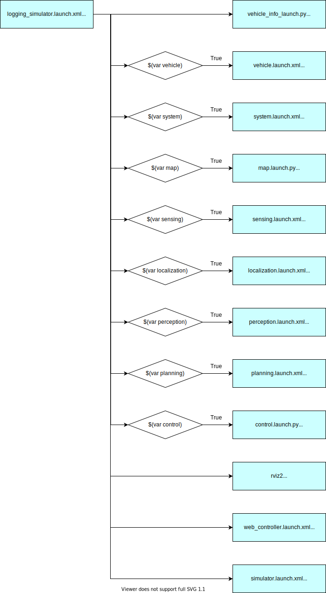

# logging_simulator 分析

## 1 调用文件分析

`logging_simulator.launch.xml` 所在的 package 名为 `autoware_launch`，调用的模块有

```xml
  <arg name="vehicle" default="true" description="launch vehicle"/>
  <arg name="system" default="true" description="launch system"/>
  <arg name="map" default="true" description="launch map"/>
  <arg name="sensing" default="true" description="launch sensing"/>
  <arg name="localization" default="true" description="launch localization"/>
  <arg name="perception" default="true" description="launch perception"/>
  <arg name="planning" default="true" description="launch planning"/>
  <arg name="control" default="true" description="launch control"/>
```

引用的 launch 文件为同级目录下的 `autoware.launch.xml`，在此文件中，根据 `logging_simulator.launch.xml`  设置的参数，调用上述程序中各项对应的 launch 文件。流程图如下：




涉及的具体的 launch 文件可以在 [Github](https://github.com/autowarefoundation/autoware.universe/tree/main/launch) 仓库查看。

## 2 流程分析

### 2.1 tier4_vehicle_launch




### 2.2 tier4_system_launch



### 2.3 tier4_map_launch



### 2.4 tier4_sensing_launch



### 2.5 tier4_localization_launch



### 2.6 tier4_perception_launch



### 2.7 tier4_planning_launch



### 2.8 tier4_control_launch



### 2.9 tier4_simulator_launch


