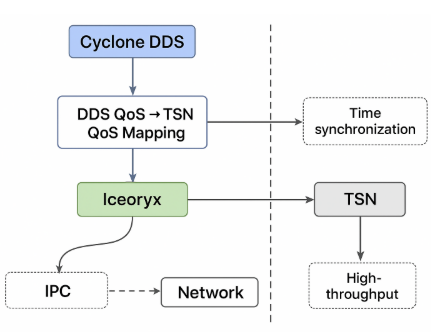

# TSN 与 QoS

“**Cyclone DDS + Iceoryx + TSN**” 的组合，正是工业/车载 DDS 领域在探索的下一代 **高吞吐 + 确定性** 实时通信架构。

## 1 介绍

### 1.1 三者各自角色

* **Cyclone DDS**
  开源 DDS 实现（Eclipse 基金会），支持 QoS、RTPS，专注于分布式实时数据分发。

* **Iceoryx**
  共享内存中间件，主要解决 DDS 在 **进程间通信（IPC）** 的低延迟高吞吐问题（零拷贝）。

  * Cyclone DDS 已有 “iceoryx DDS 插件”，在本机内节点间通信时走共享内存，不经过内核 TCP/UDP。

* **TSN**
  底层以太网确定性扩展，保证 **跨节点（分布式系统）通信的确定性**。

组合后：

* **单机内节点间通信** → Cyclone DDS + Iceoryx（高性能零拷贝）。
* **跨设备通信** → Cyclone DDS + TSN（确定性网络传输）。
* **全局一致性** → DDS 的 QoS 策略映射到底层 TSN（时隙、优先级）。

---

### 1.2 技术难点分析

#### (1) DDS QoS ↔ TSN QoS 映射

* DDS QoS 有：`latency_budget`、`deadline`、`priority`、`reliability`、`history` 等。
* TSN QoS 有：`802.1Qbv`（时间感知调度）、`802.1AS`（时间同步）、`802.1Qci`（流过滤）、`802.1Qbu`（帧抢占）。

**难点**：如何将 DDS 的抽象 QoS 精确映射到 TSN 的调度表。
比如：

* DDS topic 的 **deadline=10ms** → TSN 调度表中要配置 100Hz 的时隙。
* DDS **高优先级控制指令** → 映射到 TSN 高优先级队列（可抢占）。
  不同 DDS 实现（FastDDS / CycloneDDS / RTI Connext）在 QoS 到 TSN 的映射策略差异大，缺少统一标准。

---

#### (2) 时间同步问题

* TSN 使用 **IEEE 802.1AS（基于 PTP 1588）** 保证设备间纳秒级同步。
* DDS 应用层通常需要 **逻辑时间戳一致性**（数据排序、因果一致性）。

**难点**：

* 如何让 DDS 层的时间戳与 TSN 的 PTP 时钟保持一致？
* Cyclone DDS 默认使用系统时钟，而 TSN 用 NIC 硬件时钟（PHC）。需要对接。

---

#### (3) Iceoryx + Cyclone DDS 的集成复杂度

* Cyclone DDS 在 IPC 模式下走 Iceoryx，跨主机则走 UDP/TCP。
* 问题是：TSN 在 **L2** 层提供调度，而 Iceoryx 是 **共享内存 IPC**，两者技术层级不同。

**难点**：

* DDS 如何无缝切换：在本机走 Iceoryx，在跨机走 TSN，而应用层无感。
* Iceoryx 的内存管理是 **静态分配 + publisher/subscriber port**，而 Cyclone DDS 的 QoS（history depth、latency budget）可能冲突，需要做匹配层。

---

#### (4) 高吞吐与确定性兼容

* Iceoryx 能做到 GB/s 级吞吐（零拷贝），TSN 带宽则依赖网络调度。
* 如果 DDS topic 数据量很大（如雷达点云），在 TSN 时隙调度下可能造成 **丢帧 / 抖动**。

**难点**：

* 如何进行 **topic 分类**（大数据流 vs 小控制流），分别映射到 TSN 的不同流。
* 需要 DDS + TSN **联合调度器**，而不是单独配置。

---

#### (5) 标准与互操作性

* DDS 是 OMG 标准，TSN 是 IEEE 802.1 标准，目前没有 **官方 QoS 映射规范**。
* 各 DDS 实现（CycloneDDS、FastDDS、RTI Connext）在 TSN 支持上各自为政。

**难点**：

* 工业和车载需要 “plug-and-play”，但 DDS+TSN 的互操作性尚未完全解决。
* 目前多数是 **厂商私有扩展**（例如 RTI Connext + Cisco TSN Switch）。

---

### 1.3 典型应用难点案例

1. **自动驾驶域控**

   * 摄像头/雷达点云：高带宽 → Iceoryx（本机）+ TSN 大时隙调度（跨机）。
   * 控制命令：低延迟 → 高优先级 TSN 队列，DDS QoS 要求 deadline/ms。
     **难点**：如何同时保证点云吞吐和控制确定性。

2. **工业机器人**

   * 周期性控制报文（1ms 周期）需要 TSN 调度，DDS + Iceoryx 在本机进程内延迟要收敛到 µs。
     **难点**：DDS QoS “周期性发布”如何严格绑定到 TSN 时隙表。

---

### 1.3 总结

* **Cyclone DDS**：提供分布式数据语义和 QoS。
* **Iceoryx**：解决单机 IPC 性能瓶颈（零拷贝）。
* **TSN**：解决跨设备通信的确定性（低时延/低抖动）。

**技术难点集中在三点**：

1. DDS QoS ↔ TSN QoS 映射缺乏统一标准。
2. 时间同步（DDS 时钟 vs TSN PTP 时钟）的融合。
3. Iceoryx（共享内存）与 TSN（确定性网络）的端到端调度一致性。

---
Cyclone DDS + Iceoryx + TSN 集成架构图

## 2 TSN配置

## 2.1 环境确认

