# Docker

## 1. 安装与技术概览
### 1.1 简介
当有人提到“Docker”时，可能是指如下 3 种概念之一：
- Docker 公司
- Docker 的容器运行时和编排引擎
- Docker 开源项目（Moby）

Docker 是一种运行于 Linux 和 Windows 上的软件，用于创建、管理和编排容器。Docker 是在 GitHub 上开发的 Moby 开源项目的一部分。Docker 公司，位于旧金山，是整个 Moby 开源项目的维护者。Docker 公司还提供包含支持服务的商业版本的 Docker。

“Docker” 一词来自英国口语，意为码头工人（Dock Worker），即从船上装卸货物的人。

多数技术人员在谈到 Docker 时，主要是指 Docker 引擎。Docker 引擎是用于运行和编排容器的基础设施工具，是运行容器的核心容器运行时。

Docker 引擎主要有两个版本：企业版（EE）和社区版（CE）。每个季度，企业版和社区版都会发布一个稳定版本。社区版本会提供 4 个月的支持，而企业版本会提供 12 个月的支持。

Moby 项目的目标是基于开源的方式，发展成为 Docker 上游，并将 Docker 拆分为更多的模块化组件。Moby 项目托管于 GitHub 的 Moby 代码库，包括子项目和工具列表。核心的 Docker 引擎项目位于 GitHub 的 `moby/moby`，但是引擎中的代码正持续被拆分和模块化。

开放容器计划（The Open Container Initiative, OCI），OCI 已经发布了两份规范（标准）：镜像规范和运行时规范。
### 1.2 安装
[Ubuntu 官方安装文档](https://docs.docker.com/install/linux/docker-ce/ubuntu/)
```shell
wget -qO- https://get.docker.com/ | sh
sudo usermod -aG docker dafa # 将用户名添加到Docker组
cat /etc/group | grep docker # 检查是否添加成功
docker --version
docker system info
```
### 1.3 Docker 存储驱动的选择
每个 Docker 容器都有一个本地存储空间，用于保存层叠的镜像层（Image Layer）以及挂载的容器文件系统。默认情况下，容器的所有读写操作都发生在其镜像层上或挂载的文件系统中，所以存储是每个容器的性能和稳定性不可或缺的一个环节。

在 Linux 上，Docker 可选择的一些存储驱动包括 `AUFS`（最原始也是最老的）、`Overlay2`（可能是未来的最佳选择）、`Device Mapper`、`Btrfs` 和 `ZFS`。Docker 在 Windows 操作系统上只支持一种存储驱动，即 `Windows Filter` 。

存储驱动的选择是节点级别的。这意味着每个 Docker 主机只能选择一种存储驱动，而不能为每个容器选择不同的存储驱动。在 Linux 上，大家可以通过修改 `/etc/docker/daemon.json` 文件来修改存储引擎配置，修改完成之后需要重启 Docker 才能够生效。

如果修改了正在运行 Docker 主机的存储引擎类型，则现有的镜像和容器在重启之后将不可用，这是因为每种存储驱动在主机上存储镜像层的位置是不同的（通常在`/var/lib/docker/ /...`目录下）。修改了存储驱动的类型，Docker 就无法找到原有的镜像和容器了。切换到原来的存储驱动，之前的镜像和容器就可以继续使用了。如果希望在切换存储引擎之后还能够继续使用之前的镜像和容器，需要将镜像保存为 Docker 格式，上传到某个镜像仓库，修改本地 Docker 存储引擎并重启，之后从镜像仓库将镜像拉取到本地，最后重启容器。

`docker info` 命令即可查看存储引擎信息。选择存储驱动并正确地配置在 Docker 环境中是一件重要的事情，特别是在生产环境中。参考指南：
- Red Hat Enterprise Linux：4.x 版本内核或更高版本 + Docker 17.06 版本或更高版本，建议使用 Overlay2。
- Red Hat Enterprise Linux：低版本内核或低版本的 Docker，建议使用 Device Mapper。
- Ubuntu Linux：4.x 版本内核或更高版本，建议使用 Overlay2。
- Ubuntu Linux：更早的版本建议使用 AUFS。
- SUSE Linux Enterprise Server：Btrfs。
### 1.4 纵观 Docker
#### 1.4.1 运维
在运维视角中，主要包括下载镜像、运行新的容器、登录新容器、在容器内运行命令，以及销毁容器。

安装 Docker 的时候，会涉及两个主要组件：Docker 客户端和 Docker daemon（有时也被称为“服务端”或者“引擎”）。Docker daemon 实现了 Docker 引擎的 API。使用 Linux 默认安装时，客户端与 daemon 之间的通信是通过本地 IPC/UNIX Socket 完成的（ `/var/run/docker.sock` 文件，该文件不可读）。

对于 Docker 的镜像仓库来说，国内访问速度较慢，我们添加一个阿里云提供的 Docker 镜像加速器。

首先，我们需要编辑 `/etc/docker/daemon.json` 文件：
```shell
sudo vim /etc/docker/daemon.json
```
然后加入如下内容：
```
{
  "registry-mirrors": ["https://n6syp70m.mirror.aliyuncs.com"]
}
```
修改之后，需要重启 docker 服务，让修改生效。使用如下命令：
```shell
sudo service docker restart
```
将 Docker 镜像理解为一个包含了 OS 文件系统和应用的对象会很有帮助。在 Docker 世界中，镜像实际上等价于未运行的容器,可以将镜像比作类（Class）。

在开发视角中，更多关注与应用相关的内容。本课程会从 GitHub 拉取一些应用代码，解释其中的 Dockerfile，将应用容器化，并在容器中运行它们。在 Docker 主机上获取镜像的操作被称为拉取。如果拉取了如 nginx 或者 microsoft/iis 这样的应用容器，则会得到一个包含操作系统的镜像，并且在镜像中还包括了运行 Nginx 或 IIS 所需的代码。重要的是，Docker 的每个镜像都有自己的唯一 ID。用户可以通过引用镜像的 ID 或名称来使用镜像。如果用户选择使用镜像 ID，通常只需要输入 ID 开头的几个字符即可——因为 ID 是唯一的，Docker 知道用户想引用的具体镜像是哪个。

```shell
# 从镜像启动容器
# docker container run 告诉 Docker daemon 启动新的容器
# -it 开启容器的交互模式，将当前的 shell 连接到容器终端
# ubuntu:18.4 基于该名称的镜像启动容器
# /bin/bash 在容器内部运行 bash 进程，即 Bash Shell
docker container run -it ubuntu:18.04 /bin/bash
# 查看当前容器内正在运行的全部进程
ps -ef
# 查看系统内部全部处于运行状态的容器，加上 -a 可以查看全部容器
docker container ls -a
# 退出容器
exit
```
启动容器后，按下快捷键 `Ctrl + PQ` 即可退出容器回到系统环境并保持容器处于运行状态。但容器并未关闭，仍处于运行状态。
```shell
# 将 Shell 连接到一个运行中的容器终端
docker container exec -it ubuntu:18.04 bash
# 停止容器
docker container stop ubuntu:18.04
# 杀死容器
docker container rm ubuntu:18.04
```
#### 1.4.2 开发
通过 `docker container commint` 创建镜像示例（不易维护）
```shell
# 1 拉取镜像
docker image pull ubuntu:18.04
# 2 使用镜像创建并运行容器
docker container run --name shiyanlou01 -it ubuntu:18.04 bash
# 3 在容器中创建两个空文件 test1 test2
cd
touch test1 test2
exit
# 4 基于容器创建新镜像, dafa 是容器名， ubuntu 是镜像名，18.04.test 是版本
docker container commit dafa ubuntu:18.04.test
```
**应用容器化**，使用 `Dockerfile` 创建和修改镜像

1） 创建测试目录 test1 及其目录下的 Dockerfile
```shell
mkdir test1
cd test1
touch Dockerfile
```
2） 在 Dockerfile 中写入以下信息
```shell
# 指定基础镜像
FROM ubuntu:14.04
# 维护者信息
MAINTAINER shiyanlou/dafa@simplecloud.cn
# 镜像操作命令
RUN \
    apt-get -yqq update && \
    apt-get install -yqq apache2
# 容器启动命令
CMD ["/usr/sbin/apache2ctl", "-D", "FOREGROUND"]
```
3） 执行命令 `docker image build -t dafa:1.0 test1` ，-t 选项后面是新镜像名和标签，最后一个参数 test1 是 Dockerfile 所在目录的相对目录。创建完成新的镜像后，可以执行 `docker image ls` 命令查看，然后执行如下所示命令启动容器：
```shell
docker container run -d -p 8000:80 --name dafa01 dafa:1.0
```
上图所示命令使用 -p 选项将本机的 8000 端口映射到容器中的 80 端口上，-d 选项保证镜像可以在后台运行，--name 选项设置镜像名字。然后打开 Firefox 浏览器，在地址栏输入 127.0.0.1:8000 即可访问 Apache2 服务了。
## 2. Docker Engine
需重视升级操作的每个前置条件，包括确保容器配置了正确的重启策略；在 Swarm Mode 模式下使用服务时，需要确保正确配置了 draining node。
当完成了上述前置条件的检查之后，可以通过如下步骤完成升级操作。
- (1) 停止 Docker 守护程序
- (2) 移除旧版本的 Docker
- (3) 安装新版本的 Docker
- (4) 配置新版本的 Docker 为开机自启动
- (5) 确保容器重启成功
```shell
apt update
apt remove docker docker-engine docker-ce docker.io -y
wget -qO- https://get.docker.com/ | sh
systemctl enable docker # 配置开机自启动
systemctl is-enabled docker
docker container ls # 检查并确保每一个容器和服务都已经重启成功
docker service ls
```
### 2.1 简介
Docker 引擎是用来运行和管理容器的核心软件。基于开放容器计划（OCI）相关标准的要求，Docker 引擎采用了模块化的设计原则，其组件是可替换的。Docker 引擎由如下主要的组件构成：Docker 客户端（Docker Client）、Docker 守护进程（Docker daemon）、containerd 以及 runc 。它们共同负责容器的创建和运行。总体逻辑如下图所示：


### 2.2 摆脱 LXC

### 2.3 摒弃大而全的 Docker daemon

### 2.4 OCI 的影响

### 2.5 runc 和 containerd

### 2.6 启动新容器

### 2.7 shim

## 3. Docker 镜像

## 4. Docker 容器

## 5. 应用的容器化

## 6. 使用 Docker Compose 部署应用

## 7. Docker Swarm

## 8. Docker 网络

## 9. 卷与持久化数据

## 10. 使用 Docker Stack 部署应用

## 11. Docker 安全