# Docker

## 1. 安装与技术概览
### 1.1 简介
当有人提到“Docker”时，可能是指如下 3 种概念之一：
- Docker 公司
- Docker 的容器运行时和编排引擎
- Docker 开源项目（Moby）

Docker 是一种运行于 Linux 和 Windows 上的软件，用于创建、管理和编排容器。Docker 是在 GitHub 上开发的 Moby 开源项目的一部分。Docker 公司，位于旧金山，是整个 Moby 开源项目的维护者。Docker 公司还提供包含支持服务的商业版本的 Docker。

“Docker” 一词来自英国口语，意为码头工人（Dock Worker），即从船上装卸货物的人。

多数技术人员在谈到 Docker 时，主要是指 Docker 引擎。Docker 引擎是用于运行和编排容器的基础设施工具，是运行容器的核心容器运行时。

Docker 引擎主要有两个版本：企业版（EE）和社区版（CE）。每个季度，企业版和社区版都会发布一个稳定版本。社区版本会提供 4 个月的支持，而企业版本会提供 12 个月的支持。

Moby 项目的目标是基于开源的方式，发展成为 Docker 上游，并将 Docker 拆分为更多的模块化组件。Moby 项目托管于 GitHub 的 Moby 代码库，包括子项目和工具列表。核心的 Docker 引擎项目位于 GitHub 的 `moby/moby`，但是引擎中的代码正持续被拆分和模块化。

开放容器计划（The Open Container Initiative, OCI），OCI 已经发布了两份规范（标准）：镜像规范和运行时规范。
### 1.2 安装
[Ubuntu 官方安装文档](https://docs.docker.com/install/linux/docker-ce/ubuntu/)
```shell
wget -qO- https://get.docker.com/ | sh
sudo usermod -aG docker dafa # 将用户名添加到Docker组
cat /etc/group | grep docker # 检查是否添加成功
docker --version
docker system info
```
### 1.3 Docker 存储驱动的选择
每个 Docker 容器都有一个本地存储空间，用于保存层叠的镜像层（Image Layer）以及挂载的容器文件系统。默认情况下，容器的所有读写操作都发生在其镜像层上或挂载的文件系统中，所以存储是每个容器的性能和稳定性不可或缺的一个环节。

在 Linux 上，Docker 可选择的一些存储驱动包括 `AUFS`（最原始也是最老的）、`Overlay2`（可能是未来的最佳选择）、`Device Mapper`、`Btrfs` 和 `ZFS`。Docker 在 Windows 操作系统上只支持一种存储驱动，即 `Windows Filter` 。

存储驱动的选择是节点级别的。这意味着每个 Docker 主机只能选择一种存储驱动，而不能为每个容器选择不同的存储驱动。在 Linux 上，大家可以通过修改 `/etc/docker/daemon.json` 文件来修改存储引擎配置，修改完成之后需要重启 Docker 才能够生效。

如果修改了正在运行 Docker 主机的存储引擎类型，则现有的镜像和容器在重启之后将不可用，这是因为每种存储驱动在主机上存储镜像层的位置是不同的（通常在`/var/lib/docker/ /...`目录下）。修改了存储驱动的类型，Docker 就无法找到原有的镜像和容器了。切换到原来的存储驱动，之前的镜像和容器就可以继续使用了。如果希望在切换存储引擎之后还能够继续使用之前的镜像和容器，需要将镜像保存为 Docker 格式，上传到某个镜像仓库，修改本地 Docker 存储引擎并重启，之后从镜像仓库将镜像拉取到本地，最后重启容器。

`docker info` 命令即可查看存储引擎信息。选择存储驱动并正确地配置在 Docker 环境中是一件重要的事情，特别是在生产环境中。参考指南：
- Red Hat Enterprise Linux：4.x 版本内核或更高版本 + Docker 17.06 版本或更高版本，建议使用 Overlay2。
- Red Hat Enterprise Linux：低版本内核或低版本的 Docker，建议使用 Device Mapper。
- Ubuntu Linux：4.x 版本内核或更高版本，建议使用 Overlay2。
- Ubuntu Linux：更早的版本建议使用 AUFS。
- SUSE Linux Enterprise Server：Btrfs。
### 1.4 纵观 Docker
#### 1.4.1 运维
在运维视角中，主要包括下载镜像、运行新的容器、登录新容器、在容器内运行命令，以及销毁容器。

安装 Docker 的时候，会涉及两个主要组件：Docker 客户端和 Docker daemon（有时也被称为“服务端”或者“引擎”）。Docker daemon 实现了 Docker 引擎的 API。使用 Linux 默认安装时，客户端与 daemon 之间的通信是通过本地 IPC/UNIX Socket 完成的（ `/var/run/docker.sock` 文件，该文件不可读）。

对于 Docker 的镜像仓库来说，国内访问速度较慢，我们添加一个阿里云提供的 Docker 镜像加速器。

首先，我们需要编辑 `/etc/docker/daemon.json` 文件：
```shell
sudo vim /etc/docker/daemon.json
```
然后加入如下内容：
```
{
  "registry-mirrors": ["https://n6syp70m.mirror.aliyuncs.com"]
}
```
修改之后，需要重启 docker 服务，让修改生效。使用如下命令：
```shell
sudo service docker restart
```
将 Docker 镜像理解为一个包含了 OS 文件系统和应用的对象会很有帮助。在 Docker 世界中，镜像实际上等价于未运行的容器,可以将镜像比作类（Class）。

在开发视角中，更多关注与应用相关的内容。本课程会从 GitHub 拉取一些应用代码，解释其中的 Dockerfile，将应用容器化，并在容器中运行它们。在 Docker 主机上获取镜像的操作被称为拉取。如果拉取了如 nginx 或者 microsoft/iis 这样的应用容器，则会得到一个包含操作系统的镜像，并且在镜像中还包括了运行 Nginx 或 IIS 所需的代码。重要的是，Docker 的每个镜像都有自己的唯一 ID。用户可以通过引用镜像的 ID 或名称来使用镜像。如果用户选择使用镜像 ID，通常只需要输入 ID 开头的几个字符即可——因为 ID 是唯一的，Docker 知道用户想引用的具体镜像是哪个。

```shell
# 从镜像启动容器
# docker container run 告诉 Docker daemon 启动新的容器
# -it 开启容器的交互模式，将当前的 shell 连接到容器终端
# ubuntu:18.4 基于该名称的镜像启动容器
# /bin/bash 在容器内部运行 bash 进程，即 Bash Shell
docker container run -it ubuntu:18.04 /bin/bash
# 查看当前容器内正在运行的全部进程
ps -ef
# 查看系统内部全部处于运行状态的容器，加上 -a 可以查看全部容器
docker container ls -a
# 退出容器
exit
```
启动容器后，按下快捷键 `Ctrl + PQ` 即可退出容器回到系统环境并保持容器处于运行状态。但容器并未关闭，仍处于运行状态。
```shell
# 将 Shell 连接到一个运行中的容器终端
docker container exec -it ubuntu:18.04 bash
# 停止容器
docker container stop ubuntu:18.04
# 杀死容器
docker container rm ubuntu:18.04
```
#### 1.4.2 开发
通过 `docker container commint` 创建镜像示例（不易维护）
```shell
# 1 拉取镜像
docker image pull ubuntu:18.04
# 2 使用镜像创建并运行容器
docker container run --name shiyanlou01 -it ubuntu:18.04 bash
# 3 在容器中创建两个空文件 test1 test2
cd
touch test1 test2
exit
# 4 基于容器创建新镜像, dafa 是容器名， ubuntu 是镜像名，18.04.test 是版本
docker container commit dafa ubuntu:18.04.test
```
**应用容器化**，使用 `Dockerfile` 创建和修改镜像

1） 创建测试目录 test1 及其目录下的 Dockerfile
```shell
mkdir test1
cd test1
touch Dockerfile
```
2） 在 Dockerfile 中写入以下信息
```shell
# 指定基础镜像
FROM ubuntu:14.04
# 维护者信息
MAINTAINER shiyanlou/dafa@simplecloud.cn
# 镜像操作命令
RUN \
    apt-get -yqq update && \
    apt-get install -yqq apache2
# 容器启动命令
CMD ["/usr/sbin/apache2ctl", "-D", "FOREGROUND"]
```
3） 执行命令 `docker image build -t dafa:1.0 test1` ，-t 选项后面是新镜像名和标签，最后一个参数 test1 是 Dockerfile 所在目录的相对目录。创建完成新的镜像后，可以执行 `docker image ls` 命令查看，然后执行如下所示命令启动容器：
```shell
docker container run -d -p 8000:80 --name dafa01 dafa:1.0
```
上图所示命令使用 -p 选项将本机的 8000 端口映射到容器中的 80 端口上，-d 选项保证镜像可以在后台运行，--name 选项设置镜像名字。然后打开 Firefox 浏览器，在地址栏输入 127.0.0.1:8000 即可访问 Apache2 服务了。
## 2. Docker Engine
需重视升级操作的每个前置条件，包括确保容器配置了正确的重启策略；在 Swarm Mode 模式下使用服务时，需要确保正确配置了 draining node。
当完成了上述前置条件的检查之后，可以通过如下步骤完成升级操作。
- (1) 停止 Docker 守护程序
- (2) 移除旧版本的 Docker
- (3) 安装新版本的 Docker
- (4) 配置新版本的 Docker 为开机自启动
- (5) 确保容器重启成功
```shell
apt update
apt remove docker docker-engine docker-ce docker.io -y
wget -qO- https://get.docker.com/ | sh
systemctl enable docker # 配置开机自启动
systemctl is-enabled docker
docker container ls # 检查并确保每一个容器和服务都已经重启成功
docker service ls
```
### 2.1 简介
Docker 引擎是用来运行和管理容器的核心软件。基于开放容器计划（OCI）相关标准的要求，Docker 引擎采用了模块化的设计原则，其组件是可替换的。Docker 引擎由如下主要的组件构成：Docker 客户端（Docker Client）、Docker 守护进程（Docker daemon）、containerd 以及 runc 。它们共同负责容器的创建和运行。总体逻辑如下图所示：

### 2.2 摆脱 LXC
Docker 首次发布时，Docker 引擎由两个核心组件构成：LXC 和 Docker daemon。

LXC 提供了对诸如命名空间（Namespace）和控制组（CGroup）等基础工具的操作能力，它们是基于 Linux 内核的容器虚拟化技术。

Docker daemon 是单一的二进制文件，包含诸如 Docker 客户端、Docker API、容器运行时、镜像构建等。

下图阐释了在 Docker 旧版本中，Docker daemon、LXC 和操作系统之间的交互关系：


对 LXC 的依赖自始至终都是个问题。

首先，LXC 是基于 Linux 的。这对于一个立志于跨平台的项目来说是个问题。

其次，如此核心的组件依赖于外部工具，这会给项目带来巨大风险，甚至影响其发展。

因此，Docker 公司开发了名为 Libcontainer 的自研工具，用于替代 LXC。Libcontainer 的目标是成为与平台无关的工具，可基于不同内核为 Docker 上层提供必要的容器交互功能。

在 Docker 0.9 版本中，Libcontainer 取代 LXC 成为默认的执行驱动。

### 2.3 摒弃大而全的 Docker daemon
随着时间的推移，Docker daemon 的整体性带来了越来越多的问题：
- 难于变更
- 运行越来越慢
- 这并非生态（或 Docker 公司）所期望的

Docker 公司意识到了这些问题，开始努力着手拆解这个大而全的 Docker daemon 进程，并将其模块化。这项任务的目标是尽可能拆解出其中的功能特性，并用小而专的工具来实现它。这些小工具可以是可替换的，也可以被第三方拿去用于构建其它工具。这一计划遵循了在 UNIX 中得以实践并验证过的一种软件哲学：小而专的工具可以组装为大型工具。

这项拆解和重构 Docker 引擎的工作仍在进行中。不过，所有容器执行和容器运行时的代码已经完全从 daemon 中移除，并重构为小而专的工具。目前 Docker 引擎的架构示意图如下所示：
### 2.4 OCI 的影响
当 Docker 公司正在进行 Docker daemon 进程的拆解和重构的时候，OCI 也正在着手定义两个容器相关的规范（或者说标准）：

- 镜像规范
- 容器运行时规范

两个规范均于 2017 年 7 月发布了 1.0 版。Docker 公司参与了这些规范的制定工作，并贡献了许多的代码。

从 Docker 1.11 版本（2016 年初）开始，Docker 引擎尽可能实现了 OCI 的规范。例如，Docker daemon 不再包含任何容器运行时的代码——所有的容器运行代码在一个单独的 OCI 兼容层中实现。默认情况下，Docker 使用 runc 来实现这一点。runc 是 OCI 容器运行时标准的参考实现。如上图中的 `runc` 容器运行时层。runc 项目的目标之一就是与 OCI 规范保持一致。目前 OCI 规范均为 1.0 版本，我们不希望它们频繁地迭代，毕竟稳定胜于一切。

除此之外，Docker 引擎中的 containerd 组件确保了 Docker 镜像能够以正确的 OCI Bundle 的格式传递给 runc 。
### 2.5 runc 和 containerd


如前所述，runc 是 OCI 容器运行时规范的参考实现。Docker 公司参与了规范的制定以及 runc 的开发。

去粗取精，会发现 runc 实质上是一个轻量级的、针对 Libcontainer 进行了包装的命令行交互工具（Libcontainer 取代了早期 Docker 架构中的 LXC）。

runc 生来只有一个作用——创建容器，这一点它非常拿手，速度很快！不过它是一个 CLI 包装器，实质上就是一个独立的容器运行时工具。因此直接下载它或基于源码编译二进制文件，即可拥有一个全功能的 runc 。但它只是一个基础工具，并不提供类似 Docker 引擎所拥有的丰富功能。

有时也将 runc 所在的那一层称为 “OCI 层”，关于 runc 的发布信息见 GitHub 中 opencontainers/runc 库的 release。

在对 Docker daemon 的功能进行拆解后，所有的容器执行逻辑被重构到一个新的名为 containerd（发音为 container-dee）的工具中。它的主要任务是容器的生命周期管理—— `start | stop | pause | rm` 。

containerd 在 Linux 和 Windows 中以 daemon 的方式运行，从 1.11 版本之后 Docker 就开始在 Linux 上使用它。Docker 引擎技术栈中，containerd 位于 daemon 和 runc 所在的 OCI 层之间。Kubernetes 也可以通过 cri-containerd 使用 containerd。

如前所述，containerd 最初被设计为轻量级的小型工具，仅用于容器的生命周期管理。然而，随着时间的推移，它被赋予了更多的功能，比如镜像管理。

其原因之一在于，这样便于在其他项目中使用它。比如，在 Kubernetes 中，containerd 就是一个很受欢迎的容器运行时。然而在 Kubernetes 这样的项目中，如果 containerd 能够完成一些诸如 push 和 pull 镜像这样的操作就更好了。因此，如今 containerd 还能够完成一些容器生命周期管理之外的操作。不过，所有的额外功能都是模块化的、可选的，便于自行选择所需功能。所以，Kubernetes 这样的项目在使用 containerd 时，可以仅包含所需的功能。

containerd 是由 Docker 公司开发的，并捐献给了云原生计算基金会（Cloud Native Computing Foundation, CNCF）。2017 年 12 月发布了 1.0 版本，具体的发布信息见 GitHub 中的 containerd/ containerd 库的 releases。

### 2.6 启动新容器
常用的启动容器的方法就是使用 Docker 命令行工具。下面的 docker container run 命令会基于 alpine:latest 镜像启动一个新容器：
```shell
docker container run --name ctr1 -it alpine:latest sh
```
当使用 Docker 命令行工具执行如上命令时，Docker 客户端会将其转换为合适的 API 格式，并发送到正确的 API 端点。

API 是在 daemon 中实现的。这套功能丰富、基于版本的 REST API 已经成为 Docker 的标志，并且被行业接受成为事实上的容器 API。

一旦 daemon 接收到创建新容器的命令，它就会向 containerd 发出调用。daemon 已经不再包含任何创建容器的代码了！

daemon 使用一种 CRUD 风格的 API，通过 gRPC 与 containerd 进行通信。

虽然名叫 containerd，但是它并不负责创建容器，而是指挥 runc 去做。containerd 将 Docker 镜像转换为 OCI bundle，并让 runc 基于此创建一个新的容器。

然后，runc 与操作系统内核接口进行通信，基于所有必要的工具（Namespace、CGroup 等）来创建容器。容器进程作为 runc 的子进程启动，启动完毕后，runc 将会退出。

将所有的用于启动、管理容器的逻辑和代码从 daemon 中移除，意味着容器运行时与 Docker daemon 是解耦的，有时称之为“无守护进程的容器（daemonless container）”，如此，对 Docker daemon 的维护和升级工作不会影响到运行中的容器。

在旧模型中，所有容器运行时的逻辑都在 daemon 中实现，启动和停止 daemon 会导致宿主机上所有运行中的容器被杀掉。这在生产环境中是一个大问题——想一想新版 Docker 的发布频次吧！每次 daemon 的升级都会杀掉宿主机上所有的容器，这太糟了！

幸运的是，这已经不再是个问题。
### 2.7 shim
shim 是实现无 daemon 的容器不可或缺的工具，如上文所述，用于将运行中的容器与 daemon 解耦，以便进行 daemon 升级等操作。

前面提到，containerd 指挥 runc 来创建新容器。事实上，每次创建容器时它都会 fork 一个新的 runc 实例。不过，一旦容器创建完毕，对应的 runc 进程就会退出。因此，即使运行上百个容器，也无须保持上百个运行中的 runc 实例。

一旦容器进程的父进程 runc 退出，相关联的 containerd-shim 进程就会成为容器的父进程。作为容器的父进程，shim 的部分职责如下：

- 保持所有 STDIN 和 STDOUT 流是开启状态，从而当 daemon 重启的时候，容器不会因为管道（pipe）的关闭而终止。
- 将容器的退出状态反馈给 daemon。

**在 Linux 中的实现**

在 Linux 系统中，前面谈到的组件由单独的二进制来实现，具体包括 dockerd(Docker daemon)、docker-containerd(containerd)、docker-containerd-shim (shim) 和 docker-runc (runc)。

通过在 Docker 宿主机的 Linux 系统中执行 ps 命令可以看到以上组件的进程。当然，有些进程只有在运行容器的时候才可见。

**daemon 的作用**

当所有的执行逻辑和运行时代码都从 daemon 中剥离出来之后，问题出现了——daemon 中还剩什么？

显然，随着越来越多的功能从 daemon 中拆解出来并被模块化，这一问题的答案也会发生变化。截止目前，daemon 的主要功能包括镜像管理、镜像构建、REST API、身份验证、安全、核心网络以及编排。
### 2.8 总结
基于 OCI 的开放标准，Docker 引擎目前采用模块化设计。

Docker daemon 实现了 Docker API，该 API 是一套功能丰富、基于版本的 HTTP API，并且随着其他 Docker 项目的开发而演化。

对容器的操作由 containerd 完成。containerd 由 Docker 公司开发，并贡献给了 CNCF。它可以被看作是负责容器生命周期相关操作的容器管理器。它小巧而轻量，可被其它项目或第三方工具使用。例如，它已成为 Kubernetes 中默认的、常见的容器运行时。

containerd 需要指挥与 OCI 兼容的容器运行时来创建容器。默认情况下，Docker 使用 runc 作为其默认的容器运行时。runc 已经是 OCI 容器运行时规范的事实上的实现了，它使用与 OCI 兼容的 bundle 来启动容器。containerd 调用 runc，并确保 Docker 镜像以 OCI bundle 的格式交给 runc。

runc 可以作为独立的 CLI 工具来创建容器。它基于 Libcontainer，也可被其他项目或第三方工具使用。

仍然有许多的功能是在 Docker daemon 中实现的。其中的多数功能可能会随着时间的推移被拆解掉。目前 Docker daemon 中依然存在的功能包括但不限于 API、镜像管理、身份认证、安全特性、核心网络以及卷。

Docker 引擎的模块化工作仍在进行中。
## 3. Docker 镜像

## 4. Docker 容器

## 5. 应用的容器化

## 6. 使用 Docker Compose 部署应用

## 7. Docker Swarm

## 8. Docker 网络

## 9. 卷与持久化数据

## 10. 使用 Docker Stack 部署应用

## 11. Docker 安全