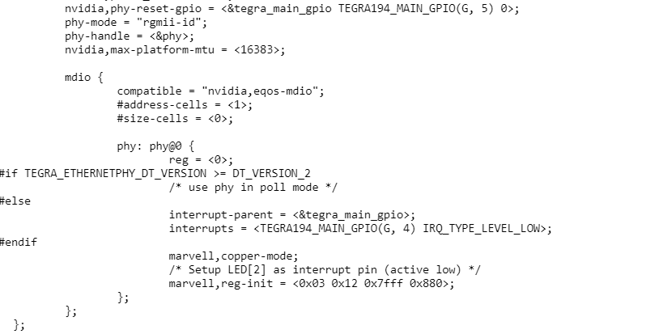

# Bug 整理

## 1 常用命令

```bash
# 确认模组型号
cat /etc/nv_boot_control.conf
# 系统版本信息
cat /etc/*release

```


## 2 PHY 的配置

1. RGMII 接口是 `ethernet@2430000`，需要在设备树将此节点使能。文件名：`source/public/hardware/nvidia/soc/t23x/kernel-dts/tegra234-soc/tegra234-soc-eqos.dtsi`。
2. MGBE 接口是 `ethernet@6810000`，不用的话需要禁掉，否则默认会使用10G网络，文件名：`hardware/nvidia/platform/t23x/concord/kernel-dts/cvb/tegra234-ethernet-3737-0000.dtsi `。
3. 在 ethernet 节点下配置PHY，像下图一样，文件名：`hardware/nvidia/platform/t23x/concord/kernel-dts/cvb/tegra234-ethernet-3737-0000.dtsi`。

4. 配置 pinmux 和 GPIO。

```shell
From 21c884060ce62c8b5bc3b39ea8bc767ad934187c Mon Sep 17 00:00:00 2001
From: Jason Mei <jianjunm@nvidia.com>
Date: Fri, 10 Jun 2022 11:30:04 +0800
Subject: [PATCH] Set eqos mad and phy pinmux in kernel dts

Usually, it's much better to set pinmux in MB1 BCT

Signed-off-by: Jason Mei <jianjunm@nvidia.com>
---
 .../tegra234-p3711-ethernet.dtsi              |  19 ++-
 .../tegra234-p3737-eqos-pinmux.dtsi           | 142 ++++++++++++++++++
 .../cvb/tegra234-ethernet-3737-0000.dtsi      |   2 +-
 .../tegra234-soc/tegra234-soc-eqos.dtsi       |   5 +-
 4 files changed, 159 insertions(+), 9 deletions(-)
 create mode 100644 hardware/nvidia/platform/t23x/common/kernel-dts/t234-common-cvb/tegra234-p3737-eqos-pinmux.dtsi

diff --git a/hardware/nvidia/platform/t23x/common/kernel-dts/t234-common-cvb/tegra234-p3711-ethernet.dtsi b/hardware/nvidia/platform/t23x/common/kernel-dts/t234-common-cvb/tegra234-p3711-ethernet.dtsi
index 953fd2939..03ccfb59f 100644
--- a/hardware/nvidia/platform/t23x/common/kernel-dts/t234-common-cvb/tegra234-p3711-ethernet.dtsi
+++ b/hardware/nvidia/platform/t23x/common/kernel-dts/t234-common-cvb/tegra234-p3711-ethernet.dtsi
@@ -19,19 +19,24 @@
 		nvidia,phy-reset-gpio = <&tegra_main_gpio TEGRA234_MAIN_GPIO(G, 5) 0>;
 		phy-mode = "rgmii-id";
 		phy-handle = <&phy>;
-		/delete-node/ fixed-link;
+		nvidia,max-platform-mtu = <16383>;
 
 		mdio {
 			compatible = "nvidia,eqos-mdio";
 			#address-cells = <1>;
 			#size-cells = <0>;
 
-			phy: phy@1 {
-				reg = <1>;
-				nvidia,phy-rst-pdelay-msec = <224>; /* msec */
-				nvidia,phy-rst-duration-usec = <10000>; /* usec */
-				interrupt-parent = <&tegra_main_gpio>;
-				interrupts = <TEGRA234_MAIN_GPIO(G, 4) IRQ_TYPE_LEVEL_LOW>;
+			phy: phy@0 {
+				reg = <0>;
+#if TEGRA_ETHERNETPHY_DT_VERSION >= DT_VERSION_2
+                                /* use phy in poll mode */
+#else
+                                interrupt-parent = <&tegra_main_gpio>;
+                                interrupts = <TEGRA234_MAIN_GPIO(G, 4) IRQ_TYPE_LEVEL_LOW>;
+#endif
+                                marvell,copper-mode;
+                                /* Setup LED[2] as interrupt pin (active low) */
+                                marvell,reg-init = <0x03 0x12 0x7fff 0x880>;
 			};
 		};
 	};
diff --git a/hardware/nvidia/platform/t23x/common/kernel-dts/t234-common-cvb/tegra234-p3737-eqos-pinmux.dtsi b/hardware/nvidia/platform/t23x/common/kernel-dts/t234-common-cvb/tegra234-p3737-eqos-pinmux.dtsi
new file mode 100644
index 000000000..12b748b2e
--- /dev/null
+++ b/hardware/nvidia/platform/t23x/common/kernel-dts/t234-common-cvb/tegra234-p3737-eqos-pinmux.dtsi
@@ -0,0 +1,142 @@
+/ {
+	pinmux@2430000 {
+		pinctrl-names = "default", "drive", "unused";
+		pinctrl-0 = <&pinmux_default>;
+		pinctrl-1 = <&drive_default>;
+		pinctrl-2 = <&pinmux_unused_lowpower>;
+		pinmux_default: common {
+			eqos_txc_pe0 {
+				nvidia,pins = "eqos_txc_pe0";
+				nvidia,function = "eqos";
+				nvidia,pull = <TEGRA_PIN_PULL_NONE>;
+				nvidia,tristate = <TEGRA_PIN_DISABLE>;
+				nvidia,enable-input = <TEGRA_PIN_DISABLE>;
+			};
+
+			eqos_td0_pe1 {
+				nvidia,pins = "eqos_td0_pe1";
+				nvidia,function = "eqos";
+				nvidia,pull = <TEGRA_PIN_PULL_NONE>;
+				nvidia,tristate = <TEGRA_PIN_DISABLE>;
+				nvidia,enable-input = <TEGRA_PIN_DISABLE>;
+			};
+
+			eqos_td1_pe2 {
+				nvidia,pins = "eqos_td1_pe2";
+				nvidia,function = "eqos";
+				nvidia,pull = <TEGRA_PIN_PULL_NONE>;
+				nvidia,tristate = <TEGRA_PIN_DISABLE>;
+				nvidia,enable-input = <TEGRA_PIN_DISABLE>;
+			};
+
+			eqos_td2_pe3 {
+				nvidia,pins = "eqos_td2_pe3";
+				nvidia,function = "eqos";
+				nvidia,pull = <TEGRA_PIN_PULL_NONE>;
+				nvidia,tristate = <TEGRA_PIN_DISABLE>;
+				nvidia,enable-input = <TEGRA_PIN_DISABLE>;
+			};
+
+			eqos_td3_pe4 {
+				nvidia,pins = "eqos_td3_pe4";
+				nvidia,function = "eqos";
+				nvidia,pull = <TEGRA_PIN_PULL_NONE>;
+				nvidia,tristate = <TEGRA_PIN_DISABLE>;
+				nvidia,enable-input = <TEGRA_PIN_DISABLE>;
+			};
+
+			eqos_tx_ctl_pe5 {
+				nvidia,pins = "eqos_tx_ctl_pe5";
+				nvidia,function = "eqos";
+				nvidia,pull = <TEGRA_PIN_PULL_NONE>;
+				nvidia,tristate = <TEGRA_PIN_DISABLE>;
+				nvidia,enable-input = <TEGRA_PIN_DISABLE>;
+			};
+
+			eqos_rd0_pe6 {
+				nvidia,pins = "eqos_rd0_pe6";
+				nvidia,function = "eqos";
+				nvidia,pull = <TEGRA_PIN_PULL_NONE>;
+				nvidia,tristate = <TEGRA_PIN_ENABLE>;
+				nvidia,enable-input = <TEGRA_PIN_ENABLE>;
+			};
+
+			eqos_rd1_pe7 {
+				nvidia,pins = "eqos_rd1_pe7";
+				nvidia,function = "eqos";
+				nvidia,pull = <TEGRA_PIN_PULL_NONE>;
+				nvidia,tristate = <TEGRA_PIN_ENABLE>;
+				nvidia,enable-input = <TEGRA_PIN_ENABLE>;
+			};
+			eqos_rd2_pf0 {
+				nvidia,pins = "eqos_rd2_pf0";
+				nvidia,function = "eqos";
+				nvidia,pull = <TEGRA_PIN_PULL_NONE>;
+				nvidia,tristate = <TEGRA_PIN_ENABLE>;
+				nvidia,enable-input = <TEGRA_PIN_ENABLE>;
+			};
+
+			eqos_rd3_pf1 {
+				nvidia,pins = "eqos_rd3_pf1";
+				nvidia,function = "eqos";
+				nvidia,pull = <TEGRA_PIN_PULL_NONE>;
+				nvidia,tristate = <TEGRA_PIN_ENABLE>;
+				nvidia,enable-input = <TEGRA_PIN_ENABLE>;
+			};
+
+			eqos_rx_ctl_pf2 {
+				nvidia,pins = "eqos_rx_ctl_pf2";
+				nvidia,function = "eqos";
+				nvidia,pull = <TEGRA_PIN_PULL_NONE>;
+				nvidia,tristate = <TEGRA_PIN_ENABLE>;
+				nvidia,enable-input = <TEGRA_PIN_ENABLE>;
+			};
+
+			eqos_rxc_pf3 {
+				nvidia,pins = "eqos_rxc_pf3";
+				nvidia,function = "eqos";
+				nvidia,pull = <TEGRA_PIN_PULL_NONE>;
+				nvidia,tristate = <TEGRA_PIN_ENABLE>;
+				nvidia,enable-input = <TEGRA_PIN_ENABLE>;
+			};
+
+			eqos_sma_mdio_pf4 {
+				nvidia,pins = "eqos_sma_mdio_pf4";
+				nvidia,function = "eqos";
+				nvidia,pull = <TEGRA_PIN_PULL_NONE>;
+				nvidia,tristate = <TEGRA_PIN_DISABLE>;
+				nvidia,enable-input = <TEGRA_PIN_ENABLE>;
+			};
+
+			eqos_sma_mdc_pf5 {
+				nvidia,pins = "eqos_sma_mdc_pf5";
+				nvidia,function = "eqos";
+				nvidia,pull = <TEGRA_PIN_PULL_NONE>;
+				nvidia,tristate = <TEGRA_PIN_DISABLE>;
+				nvidia,enable-input = <TEGRA_PIN_DISABLE>;
+			};
+			soc_gpio17_pg4 {
+				nvidia,pins = "soc_gpio17_pg4";
+				nvidia,function = "rsvd0";
+				nvidia,pull = <TEGRA_PIN_PULL_UP>;
+				nvidia,tristate = <TEGRA_PIN_ENABLE>;
+				nvidia,enable-input = <TEGRA_PIN_ENABLE>;
+				nvidia,lpdr = <TEGRA_PIN_DISABLE>;
+			};
+
+			soc_gpio18_pg5 {
+				nvidia,pins = "soc_gpio18_pg5";
+				nvidia,function = "rsvd0";
+				nvidia,pull = <TEGRA_PIN_PULL_NONE>;
+				nvidia,tristate = <TEGRA_PIN_DISABLE>;
+				nvidia,enable-input = <TEGRA_PIN_DISABLE>;
+				nvidia,lpdr = <TEGRA_PIN_DISABLE>;
+			};
+		};
+		pinmux_unused_lowpower: unused_lowpower {
+		};
+		drive_default: drive {
+		};
+	};
+
+};
diff --git a/hardware/nvidia/platform/t23x/concord/kernel-dts/cvb/tegra234-ethernet-3737-0000.dtsi b/hardware/nvidia/platform/t23x/concord/kernel-dts/cvb/tegra234-ethernet-3737-0000.dtsi
index 05c2ba700..ce4411a35 100644
--- a/hardware/nvidia/platform/t23x/concord/kernel-dts/cvb/tegra234-ethernet-3737-0000.dtsi
+++ b/hardware/nvidia/platform/t23x/concord/kernel-dts/cvb/tegra234-ethernet-3737-0000.dtsi
@@ -19,7 +19,7 @@
 / {
 	/* MGBE - A */
 	ethernet@6810000 {
-		status = "okay";
+		status = "disabled";
 		nvidia,mac-addr-idx = <0>;
 		nvidia,max-platform-mtu = <16383>;
 		/* 0=enable, 1=disable */
diff --git a/hardware/nvidia/soc/t23x/kernel-dts/tegra234-soc/tegra234-soc-eqos.dtsi b/hardware/nvidia/soc/t23x/kernel-dts/tegra234-soc/tegra234-soc-eqos.dtsi
index e8ce274ec..baced39f0 100644
--- a/hardware/nvidia/soc/t23x/kernel-dts/tegra234-soc/tegra234-soc-eqos.dtsi
+++ b/hardware/nvidia/soc/t23x/kernel-dts/tegra234-soc/tegra234-soc-eqos.dtsi
@@ -18,6 +18,9 @@
  * tegra234-soc-eqos.dtsi: Ethernet QOS DTSI file.
  */
 
+#include <t234-common-cvb/tegra234-p3711-ethernet.dtsi>
+#include <t234-common-cvb/tegra234-p3737-eqos-pinmux.dtsi>
+
 / {
 	pinmux@2430000 {
 		eqos_mii_rx_input_state_disable: eqos_rx_disable {
@@ -108,7 +111,7 @@
 		nvidia,tx-queue-prio = <0x0 0x7 0x2 0x3 0x0 0x0 0x0 0x0>;
 		nvidia,rxq_enable_ctrl = <2 2 2 2 2 2 2 2>;
 		nvidia,vm-irq-config = <&eqos_vm_irq_config>;
-		status = "disabled";
+		status = "okay";
 		nvidia,dcs-enable = <0x1>;
 		nvidia,pad_calibration = <0x1>;
 		nvidia,rx_riwt = <512>;
-- 
2.25.1
```

> 参考：[Dose Orin support 88E1512 PHY chip](https://forums.developer.nvidia.com/t/does-orin-support-88e1512-phy-chip/215951)
>

## 3 使用EDK2编译UEFI

在[Build without docker](https://github.com/NVIDIA/edk2-nvidia/wiki/Build-without-docker)中，创建工作空间时，可以选择具体的版本：

```bash
# 文档中的命令
edkrepo clone nvidia-uefi NVIDIA-Platforms main
# L4T 35.3
edkrepo clone nvidia-uefi-r35.3.1 NVIDIA-Jetson r35.3.1
```

不过还是推荐使用Docker方式。

[**修改LOGO**](https://forums.developer.nvidia.com/t/customized-logo-for-xavier-nx/231993/8)

- 将 bmp 文件放在 `edk2-nvidia/Silicon/NVIDIA/Assets`，
- 在`Platform/NVIDIA/NVIDIA.fvmain.fdf.inc`中修改文件名，重新编译UEFI。
- 在`images`目录下会有两个文件：uefi_Jetson_DEBUG.bin，uefi_Jetson_RELEASE.bin，选择一个重命名为`uefi_Jetson.bin`，放到刷机目录`Linux_for_Tegra/bootloader`下

