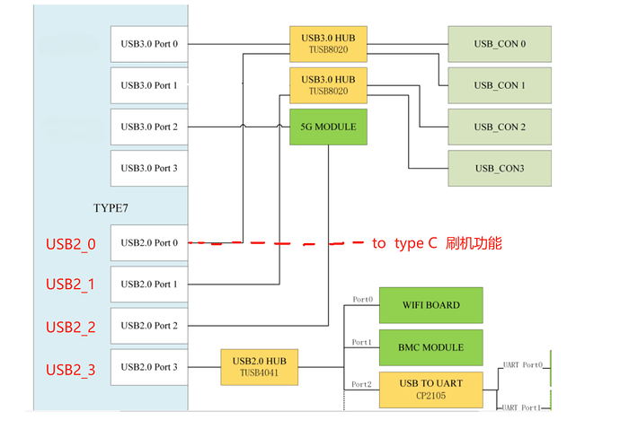

# JP 6.2适配

## 1 配置脚本

```shell
#!/bin/bash
#============================================================
# Author   : dafa
# Date     : 2023-04-25
# Platform : Jetson AGX Orin
# Function : BSP / Kernel Build / Flash / Massflash / Initrd
#============================================================

set -e

#------------------------------------------------------------
# Root privilege check
#------------------------------------------------------------
if [[ $(id -u) -ne 0 ]]; then
  echo "[ERROR] This script must be run as root."
  exit 1
fi

#------------------------------------------------------------
# Menu
#------------------------------------------------------------
init_menu() {
  read -r -t 30 -p "
==================== MENU ====================
[1 ] src                 解压 BSP 与内核源码
[2 ] build               内核配置并编译
[3 ] create massflash    生成 massflash 包
[4 ] massflash           执行 massflash
[5 ] devkit_flash        标准 eMMC 烧录
[6 ] default_user        创建默认用户
[7 ] nvbuild             使用 nvbuild.sh
[8 ] clean               清理内核
[9 ] Image               仅编译 Image
[10] DTS                 仅编译 DTB
[11] modules             仅编译 modules
[12] build (no menu)     快速内核编译
[13] setup_driver        驱动初始化
[14] initrd_flash        NVMe / USB / External Only
==============================================
Choose: " NUM
}

#------------------------------------------------------------
# Environment setup
#------------------------------------------------------------
setup_env() {
  export TOP_DIR=$(pwd)
  export WS=$TOP_DIR/BSP

  export L4T_RELEASE_PACKAGE=$WS/Jetson_Linux_r36.4.4_aarch64.tbz2
  export SAMPLE_FS_PACKAGE=$WS/Tegra_Linux_Sample-Root-Filesystem_r36.4.4_aarch64.tbz2

  export BOARD=jetson-agx-orin-devkit
  export ARCH=arm64
  export LOCALVERSION=-tegra

  export CROSS_COMPILE=$TOP_DIR/l4t-gcc/aarch64--glibc--stable-2022.08-1/bin/aarch64-buildroot-linux-gnu-

  export KERNEL_SOURCE=$WS/Linux_for_Tegra/source
  export KERNEL_HEADERS=$KERNEL_SOURCE/kernel/kernel-jammy-src
  export INSTALL_MOD_PATH=$WS/Linux_for_Tegra/rootfs
}

#------------------------------------------------------------
# BSP & Kernel Source
#------------------------------------------------------------
src() {
  echo "[INFO] Extracting BSP..."
  cd "$WS"

  tar -xpf "$L4T_RELEASE_PACKAGE"
  tar -xpf "$SAMPLE_FS_PACKAGE" -C Linux_for_Tegra/rootfs/

  cd Linux_for_Tegra
  ./apply_binaries.sh

  echo "[INFO] Extracting kernel sources..."
  cd "$WS"
  tar xf public_sources.tbz2

  cd Linux_for_Tegra/source
  tar xf kernel_src.tbz2
  tar xf kernel_oot_modules_src.tbz2
  tar xf nvidia_kernel_display_driver_source.tbz2

  echo "[OK] BSP & Kernel source ready."
}

#------------------------------------------------------------
# Kernel build (full)
#------------------------------------------------------------
build() {
  cd "$KERNEL_SOURCE"

  echo "[INFO] Building kernel..."
  make -C kernel -j"$(nproc)"
  make -C kernel install

  make dtbs
  make modules_install INSTALL_MOD_PATH="$INSTALL_MOD_PATH"

  cp kernel/kernel-jammy-src/arch/arm64/boot/Image \
     "$WS/Linux_for_Tegra/kernel/Image"

  cp kernel-devicetree/generic-dts/dtbs/* \
     "$WS/Linux_for_Tegra/kernel/dtb/"
}

#------------------------------------------------------------
# Quick build (no menuconfig)
#------------------------------------------------------------
linux() {
  cd "$KERNEL_SOURCE"

  make -C kernel
  make -C kernel install
  make dtbs
  make modules
  make modules_install

  cp kernel/kernel-jammy-src/arch/arm64/boot/Image \
     "$WS/Linux_for_Tegra/kernel/Image"

  cp kernel-devicetree/generic-dts/dtbs/* \
     "$WS/Linux_for_Tegra/kernel/dtb/"
}

#------------------------------------------------------------
# nvbuild.sh
#------------------------------------------------------------
nvbuild() {
  cd "$KERNEL_SOURCE"
  ./nvbuild.sh -i "$INSTALL_MOD_PATH"
}

#------------------------------------------------------------
# Image only
#------------------------------------------------------------
Image() {
  cd "$KERNEL_SOURCE"
  make -C kernel
  make -C kernel install

  cp kernel/kernel-jammy-src/arch/arm64/boot/Image \
     "$WS/Linux_for_Tegra/kernel/Image"
}

#------------------------------------------------------------
# DTS only
#------------------------------------------------------------
dts() {
  cd "$KERNEL_SOURCE"
  make dtbs

  cp kernel-devicetree/generic-dts/dtbs/* \
     "$WS/Linux_for_Tegra/kernel/dtb/"
}

#------------------------------------------------------------
# Modules only
#------------------------------------------------------------
modules() {
  cd "$KERNEL_SOURCE"
  make modules
  make modules_install

  cd "$WS/Linux_for_Tegra"
  ./tools/l4t_update_initrd.sh
}

#------------------------------------------------------------
# Clean
#------------------------------------------------------------
clean() {
  cd "$KERNEL_SOURCE"
  make -C kernel clean
  make clean
}

#------------------------------------------------------------
# Massflash package
#------------------------------------------------------------
mfi() {
  systemctl stop udisks2.service
  cd "$WS/Linux_for_Tegra"

  read -r -p "
[1] EIS860 32GB Offline
[2] EIS860 64GB Offline
[3] EIS860 Online
Choose: " TYPE

  case $TYPE in
    1) BOARDID=3701 BOARDSKU=0004 ;;
    2) BOARDID=3701 BOARDSKU=0005 ;;
    *) ;;
  esac

  sudo BOARDID=$BOARDID FAB=500 BOARDSKU=$BOARDSKU BOARDREV=F.0 \
    ./tools/kernel_flash/l4t_initrd_flash.sh \
    --no-flash --network usb0 --massflash 10 \
    "$BOARD" mmcblk0p1
}

#------------------------------------------------------------
# Massflash execution
#------------------------------------------------------------
massflash() {
  cd "$WS/Linux_for_Tegra/mfi_jetson-agx-orin-devkit"
  sudo ./tools/kernel_flash/l4t_initrd_flash.sh \
       --network usb0 --flash-only --massflash 1
}

#------------------------------------------------------------
# Devkit flash (eMMC)
#------------------------------------------------------------
devkit_flash() {
  cd "$WS/Linux_for_Tegra"
  sudo ./flash.sh "$BOARD" internal
}

#------------------------------------------------------------
# Default user
#------------------------------------------------------------
default_user() {
  cd "$WS/Linux_for_Tegra/tools"
  ./l4t_create_default_user.sh -u orin -p 123456a? -n eis860
}

#------------------------------------------------------------
# Driver setup
#------------------------------------------------------------
setup_driver() {
  "$TOP_DIR/patch/cfg.sh"
}

#------------------------------------------------------------
# Initrd Flash (NVMe / USB / External Only)
#------------------------------------------------------------
initrd_flash() {
  cd "$WS/Linux_for_Tegra"

  read -r -p "
[A] NVMe
[B] USB
[C] External Only
Choose: " MODE

  MODE=${MODE^^}

  case $MODE in
    A)
      ./tools/kernel_flash/l4t_initrd_flash.sh \
        --external-device nvme0n1p1 \
        -c tools/kernel_flash/flash_l4t_t234_nvme.xml \
        -S 900GiB --showlogs --network usb0 \
        "$BOARD" nvme0n1p1
      ;;
    B)
      ./tools/kernel_flash/l4t_initrd_flash.sh \
        --external-device sda1 \
        -c tools/kernel_flash/flash_l4t_external.xml \
        --showlogs --network usb0 \
        "$BOARD" sda1
      ;;
    C)
      ./tools/kernel_flash/l4t_initrd_flash.sh \
        --external-only \
        --external-device nvme0n1p1 \
        -c tools/kernel_flash/flash_l4t_t234_nvme.xml \
        --showlogs --network usb0 \
        "$BOARD" nvme0n1p1
      ;;
    *)
      echo "[ERROR] Invalid choice."
      ;;
  esac
}

#------------------------------------------------------------
# Main
#------------------------------------------------------------
init_menu
setup_env

case $NUM in
  1) src ;;
  2) build ;;
  3) mfi ;;
  4) massflash ;;
  5) devkit_flash ;;
  6) default_user ;;
  7) nvbuild ;;
  8) clean ;;
  9) Image ;;
 10) dts ;;
 11) modules ;;
 12) linux ;;
 13) setup_driver ;;
 14) initrd_flash ;;
  *) echo "[ERROR] Invalid option." ;;
esac
```

## 2 T23x 设备树

### 2.1 简介

配置设备树之前，要完成[内核自定义](https://docs.nvidia.com/jetson/archives/r36.4.4/DeveloperGuide/SD/Kernel/KernelCustomization.html#sd-kernel-kernelcustomization)。

设备树dts文件的位置： `Linux_for_Tegra/source/hardware/nvidia/t23x/nv-public`

设备树编译生成文件dtb的位置： `Linux_for_Tegra/source/kernel-devicetree/generic-dts/dtbs`

AGX Orin 64GB模组的设备树名称：`kernel_tegra234-p3737-0000+p3701-0005-nv.dtb`

AGX Orin 32GB模组的设备树名称：`kernel_tegra234-p3737-0000+p3701-0004-nv.dtb`

#### **设备树的层级结构**

1. **底层（Upstream Linux Kernel）**:
   - 来源：**Linux 内核社区的上游代码**。
   - 作用：保持 NVIDIA 平台的设备树配置与上游内核的基础设备树文件对齐。
   - 存放位置：`nv-public` 文件夹的根目录。
   - 示例文件：`nv-public/tegra234-p3737-0000+p3701-0000.dts`。
     - 此文件定义了设备的基本硬件配置。

2. **顶层（NV-Platform Layer）**:
   - 来源：**NVIDIA 的平台目录 (nv-platform)**。
   - 作用：在上游设备树文件的基础上，添加特定于 NVIDIA 平台的内容或对其进行更新。
   - 文件命名：
     - 文件名与上游设备树文件的名称保持一致，但在文件名末尾添加 `-nv`。
     - 示例文件：`nv-platform/tegra234-p3737-0000+p3701-0000-nv.dts`。
   - 工作方式：
     - **继承与扩展**：通过包含（`#include`）底层设备树文件，并在此基础上添加内容或更新配置。
**总结**
NVIDIA 的设备树组织结构分为底层（与上游内核对齐）和顶层（平台扩展）。通过这种分层设计，设备树既保持了与内核的兼容性，也允许 NVIDIA 针对其特定硬件进行自定义优化。这种设计适用于支持多 SKU 和模块的复杂硬件平台，如 AGX Orin。

### 5.2 5G驱动

执行`make menuconfig`时，设置以下内容


```shell
CONFIG_USB_WDM=m
CONFIG_USB_NET_QMI_WWAN=m
CONFIG_USB_HSO=m
CONFIG_WWAN=m
```

拨号文件`quectel-CM`由`QConnectManager_Linux_V1.6.5.zip`编译而来，进入OS测试：

```shell
$ lsmod | grep wwan
usb_wwan               24576  1 option
qmi_wwan               36864  0
usbserial              45056  3 cp210x,usb_wwan,option
usbnet                 45056  1 qmi_wwan

# 没有插手机卡的日志
$ sudo ./quectel-CM
[08-27_07:13:08:265] QConnectManager_Linux_V1.6.5
[08-27_07:13:08:266] Find /sys/bus/usb/devices/2-3 idVendor=0x2c7c idProduct=0x800, bus=0x002, dev=0x002
[08-27_07:13:08:266] Auto find qmichannel = /dev/cdc-wdm0
[08-27_07:13:08:266] Auto find usbnet_adapter = wwan0
[08-27_07:13:08:266] netcard driver = qmi_wwan, driver version = 5.15.148-tegra
[08-27_07:13:08:266] Modem works in QMI mode
[08-27_07:13:08:280] /proc/951/fd/7 -> /dev/cdc-wdm0
[08-27_07:13:08:280] /proc/951/exe -> /usr/libexec/qmi-proxy
[08-27_07:13:10:298] cdc_wdm_fd = 7
[08-27_07:13:10:392] Get clientWDS = 15
[08-27_07:13:10:424] Get clientDMS = 1
[08-27_07:13:10:456] Get clientNAS = 2
[08-27_07:13:10:488] Get clientUIM = 1
[08-27_07:13:10:520] Get clientWDA = 1
[08-27_07:13:10:584] requestBaseBandVersion RM500QGLABR10A02M4G
[08-27_07:13:10:744] requestGetSIMStatus SIMStatus: SIM_ABSENT
[08-27_07:13:10:808] requestGetProfile[pdp:1 index:1] 3GNET///0/IPV4V6
[08-27_07:13:10:840] requestRegistrationState2 MCC: 460, MNC: 0, PS: Detached, DataCap: UNKNOW
[08-27_07:13:10:872] requestRegistrationState2 MCC: 460, MNC: 0, PS: Detached, DataCap: UNKNOW
[08-27_07:13:10:904] requestQueryDataCall IPv4ConnectionStatus: DISCONNECTED
[08-27_07:13:10:904] ip addr flush dev wwan0
[08-27_07:13:10:909] ip link set dev wwan0 down
[08-27_07:13:25:944] requestRegistrationState2 MCC: 460, MNC: 0, PS: Detached, DataCap: UNKNOW

# 正常的日志
$ sudo ./quectel-CM
[08-27_06:59:41:561] QConnectManager_Linux_V1.6.5
[08-27_06:59:41:561] Find /sys/bus/usb/devices/2-3 idVendor=0x2c7c idProduct=0x800, bus=0x002, dev=0x002
[08-27_06:59:41:562] Auto find qmichannel = /dev/cdc-wdm0
[08-27_06:59:41:562] Auto find usbnet_adapter = wwan0
[08-27_06:59:41:562] netcard driver = qmi_wwan, driver version = 5.15.148-tegra
[08-27_06:59:41:562] Modem works in QMI mode
[08-27_06:59:41:576] /proc/943/fd/7 -> /dev/cdc-wdm0
[08-27_06:59:41:576] /proc/943/exe -> /usr/libexec/qmi-proxy
[08-27_06:59:43:597] cdc_wdm_fd = 7
[08-27_06:59:43:667] Get clientWDS = 15
[08-27_06:59:43:699] Get clientDMS = 1
[08-27_06:59:43:730] Get clientNAS = 2
[08-27_06:59:43:762] Get clientUIM = 1
[08-27_06:59:43:794] Get clientWDA = 1
[08-27_06:59:43:826] requestBaseBandVersion RM500QGLABR10A02M4G
[08-27_06:59:43:953] requestGetSIMStatus SIMStatus: SIM_READY
[08-27_06:59:44:016] requestGetProfile[pdp:1 index:1] 3GNET///0/IPV4V6
[08-27_06:59:44:048] requestRegistrationState2 MCC: 460, MNC: 1, PS: Attached, DataCap: LTE
[08-27_06:59:44:080] requestQueryDataCall IPv4ConnectionStatus: DISCONNECTED
[08-27_06:59:44:080] ip addr flush dev wwan0
[08-27_06:59:44:085] ip link set dev wwan0 down
[08-27_06:59:44:175] requestSetupDataCall WdsConnectionIPv4Handle: 0x3529f760
[08-27_06:59:44:302] ip link set dev wwan0 up
[08-27_06:59:44:311] No default.script found, it should be in '/usr/share/udhcpc/' or '/etc//udhcpc' depend on your udhcpc version!
[08-27_06:59:44:311] busybox udhcpc -f -n -q -t 5 -i wwan0
udhcpc: started, v1.30.1
udhcpc: sending discover
udhcpc: sending discover
udhcpc: sending discover
udhcpc: sending discover
udhcpc: sending discover
udhcpc: no lease, failing
[08-27_06:59:59:576] File:ql_raw_ip_mode_check Line:147 udhcpc fail to get ip address, try next:
[08-27_06:59:59:576] ip link set dev wwan0 down
[08-27_06:59:59:584] echo Y > /sys/class/net/wwan0/qmi/raw_ip
[08-27_06:59:59:584] ip link set dev wwan0 up
[08-27_06:59:59:589] busybox udhcpc -f -n -q -t 5 -i wwan0
udhcpc: started, v1.30.1
udhcpc: sending discover
udhcpc: sending select for 10.10.226.100
udhcpc: lease of 10.10.226.100 obtained, lease time 7200
[08-27_06:59:59:860] ip -4 address flush dev wwan0
[08-27_06:59:59:864] ip -4 address add 10.10.226.100/29 dev wwan0
[08-27_06:59:59:869] ip -4 route add default via 10.10.226.101 dev wwan0
```

### 5.3 USB驱动

#### 5.3.1 适配代码

参考[官方文档](https://docs.nvidia.com/jetson/archives/r36.4.4/DeveloperGuide/HR/JetsonModuleAdaptationAndBringUp/JetsonAgxOrinSeries.html#porting-the-universal-serial-bus)进行适配。

以下是设备的USB拓扑图，需要注意的是USB3-1的companion应该有错误，以下的驱动代码是测试OK的。



```shell
diff --git a/hardware/nvidia/t23x/nv-public/tegra234-p3737-0000+p3701-0000.dts b/hardware/nvidia/t23x/nv-public/tegra234-p3737-0000+p3701-0000.dts
index 575970de0..97e48d985 100644
--- a/hardware/nvidia/t23x/nv-public/tegra234-p3737-0000+p3701-0000.dts
+++ b/hardware/nvidia/t23x/nv-public/tegra234-p3737-0000+p3701-0000.dts
@@ -71,7 +71,7 @@
                                usb3 {
                                        lanes {
                                                usb3-0 {
-                                                       status = "okay";
+                                                       status = "disable";
                                                };

                                                usb3-1 {
@@ -90,21 +90,11 @@
                                        mode = "otg";
                                        usb-role-switch;
                                        status = "okay";
-                                       port {
-                                               hs_typec_p1: endpoint {
-                                                       remote-endpoint = <&hs_ucsi_ccg_p1>;
-                                               };
-                                       };
                                };

                                usb2-1 {
                                        mode = "host";
                                        status = "okay";
-                                       port {
-                                               hs_typec_p0: endpoint {
-                                                       remote-endpoint = <&hs_ucsi_ccg_p0>;
-                                               };
-                                       };
                                };

                                usb2-2 {
@@ -119,22 +109,12 @@

                                usb3-0 {
                                        nvidia,usb2-companion = <1>;
-                                       status = "okay";
-                                       port {
-                                               ss_typec_p0: endpoint {
-                                                       remote-endpoint = <&ss_ucsi_ccg_p0>;
-                                               };
-                                       };
+                                       status = "disable";
                                };

                                usb3-1 {
-                                       nvidia,usb2-companion = <0>;
+                                       nvidia,usb2-companion = <1>;
                                        status = "okay";
-                                       port {
-                                               ss_typec_p1: endpoint {
-                                                       remote-endpoint = <&ss_ucsi_ccg_p1>;
-                                               };
-                                       };
                                };

                                usb3-2 {
@@ -147,9 +127,8 @@
                usb@3550000 {
                        status = "okay";

-                       phys = <&{/bus@0/padctl@3520000/pads/usb2/lanes/usb2-0}>,
-                              <&{/bus@0/padctl@3520000/pads/usb3/lanes/usb3-1}>;
-                       phy-names = "usb2-0", "usb3-0";
+                       phys = <&{/bus@0/padctl@3520000/pads/usb2/lanes/usb2-0}>;
+                       phy-names = "usb2-0";
                };

                usb@3610000 {
@@ -159,11 +138,10 @@
                               <&{/bus@0/padctl@3520000/pads/usb2/lanes/usb2-1}>,
                               <&{/bus@0/padctl@3520000/pads/usb2/lanes/usb2-2}>,
                               <&{/bus@0/padctl@3520000/pads/usb2/lanes/usb2-3}>,
-                              <&{/bus@0/padctl@3520000/pads/usb3/lanes/usb3-0}>,
                               <&{/bus@0/padctl@3520000/pads/usb3/lanes/usb3-1}>,
                               <&{/bus@0/padctl@3520000/pads/usb3/lanes/usb3-2}>;
                        phy-names = "usb2-0", "usb2-1", "usb2-2", "usb2-3",
-                                   "usb3-0", "usb3-1", "usb3-2";
+                                   "usb3-1", "usb3-2";
                };
```

#### 5.3.2 USB控制器说明

在 NVIDIA Jetson 的设备树中，这三个地址对应了 USB 子系统的三个核心组件。

简单来说，它们分别是：**物理层管理者**、**设备模式控制器**、**主机模式控制器**。

以下是详细的架构解析：

1. `usb@3520000` —— XUSB Padctl (The Manager)

* **全称**：XUSB Pad Controller (物理层控制器)
* **角色**：**基建管理者 / 交换机**
* **功能**：
* 这是修改最多的地方。它不直接传输数据，而是负责管理底层的物理电气信号（PHY）。
* 它掌管着所有的 UPHY Lanes（高速差分线）和 USB 2.0 Lanes。
* **负责路由**：它决定某一条物理线路（Lane）是分配给 USB 3.0，还是 PCIe，或者是 SATA。
* **负责复用**：它负责将 USB 2.0 端口映射到对应的 USB 3.0 端口（即修改的 `nvidia,usb2-companion`）。


* **在设备树中的体现**：
* 包含 `pads`（物理焊盘）和 `ports`（逻辑端口）的定义。
* 负责 VBUS 供电控制（`vbus-supply`）和 ID 引脚检测。


> **形象比喻**：它是**配线架管理员**。它不负责打电话，但它负责把墙上的网口跳线跳到正确的交换机上。

---

2. `usb@3550000` —— XUDC (The Device)

* **全称**：XUSB Device Controller (设备模式控制器)
* **角色**：**从设备 (Peripheral / Gadget)**
* **功能**：
* 当 Jetson 需要把自己伪装成一个 USB 设备插入电脑时，由这个控制器负责。
* **刷机模式 (Recovery Mode)**：当按住 Recovery 键上电，用 USB 线连电脑刷机时，就是它在工作。
* **模拟网卡 (RNDIS)**：Orin 启动后，通过 Type-C 线连电脑，电脑上出现的那个虚拟网卡（通常 IP 是 `192.168.55.1`），也是由它生成的。


* **关联**：它通常只占用 `usb2-0` (Type-C) 这个物理口。

> **形象比喻**：这是 Jetson 的**外交官**。当 Jetson 需要去“拜访”其他电脑（作为客体/U盘/网卡）时，由它出面。

---

3. `usb@3610000` —— XHCI (The Host)

* **全称**：Tegra XUSB xHCI Host Controller (主机模式控制器)
* **角色**：**主机 (Host / Master)**
* **功能**：
* 这是最常用的控制器。它是 USB 3.x 的主控，同时也兼容 USB 2.0。
* 它负责管理所有插入 Jetson 的外设（鼠标、键盘、HUB、5G 模组、摄像头）。
* `lsusb` 命令列出的根集线器（Root Hub）就是由它生成的。
* 它通过向 `usb@3520000` (Padctl) 申请资源来获得物理通路的控制权。


* **在日志中的体现**：
* `tegra-xusb` 驱动就是它。
* `Bus 01` (USB 2.0) 和 `Bus 02` (USB 3.0) 都是它创建的总线。

> **形象比喻**：这是 Jetson 的**大管家**。它坐在家里，指挥和管理所有连接进来的外部设备。

---

它们是如何协作的？

当把 5G 模组插入载板时，系统内部发生了如下对话：

1. **物理层 (`usb@3520000`)**：检测到信号，确认物理连接，根据设备树配置，将 `Lane 2` (物理线) 准备好。
2. **主机控制器 (`usb@3610000`)**：接管这条线路，发起 USB 握手协议，识别出这是一个 10Gbps 的设备。
3. **驱动层**：加载 `option` 驱动，生成 `/dev/ttyUSB*`。

**总结图示：**

```mermaid
graph TD
    A[外部设备 / 物理接口] --> B(usb@3520000 <br> XUSB Padctl <br> 物理层控制器);

    B -- 如果是 OTG 且连了电脑 --> C(usb@3550000 <br> XUDC <br> 设备控制器);
    B -- 如果连了鼠标/5G/U盘 --> D(usb@3610000 <br> XHCI <br> 主机控制器);

    style B fill:#f9f,stroke:#333,stroke-width:2px
    style D fill:#bbf,stroke:#333,stroke-width:4px

```

**为什么会出现配置不通？**
是因为 **XHCI (`3610000`)** 想要调用 USB 3.0 资源，它去问 **Padctl (`3520000`)** 要物理线路。
但 Padctl 的配置表（设备树）里写错了伴随关系（Companion），导致 Padctl 把线路指错了房间，XHCI 也就没法和设备建立握手，最终导致 USB 3.0 无法建立。


#### 5.3.3 lsusb结果

```shell
$ lsusb -t
/:  Bus 02.Port 1: Dev 1, Class=root_hub, Driver=tegra-xusb/4p, 10000M
    |__ Port 2: Dev 2, If 0, Class=Hub, Driver=hub/2p, 5000M
    |__ Port 3: Dev 3, If 0, Class=Vendor Specific Class, Driver=option, 10000M
    |__ Port 3: Dev 3, If 1, Class=Vendor Specific Class, Driver=option, 10000M
    |__ Port 3: Dev 3, If 2, Class=Vendor Specific Class, Driver=option, 10000M
    |__ Port 3: Dev 3, If 3, Class=Vendor Specific Class, Driver=option, 10000M
    |__ Port 3: Dev 3, If 4, Class=Vendor Specific Class, Driver=qmi_wwan, 10000M
/:  Bus 01.Port 1: Dev 1, Class=root_hub, Driver=tegra-xusb/4p, 480M
    |__ Port 1: Dev 7, If 0, Class=Hub, Driver=hub/2p, 480M
    |__ Port 2: Dev 2, If 0, Class=Hub, Driver=hub/2p, 480M
        |__ Port 1: Dev 5, If 1, Class=Human Interface Device, Driver=usbhid, 12M
        |__ Port 1: Dev 5, If 0, Class=Human Interface Device, Driver=usbhid, 12M
    |__ Port 4: Dev 4, If 0, Class=Hub, Driver=hub/4p, 480M
        |__ Port 3: Dev 6, If 3, Class=Vendor Specific Class, Driver=cp210x, 12M
        |__ Port 3: Dev 6, If 1, Class=Vendor Specific Class, Driver=cp210x, 12M
        |__ Port 3: Dev 6, If 2, Class=Vendor Specific Class, Driver=cp210x, 12M
        |__ Port 3: Dev 6, If 0, Class=Vendor Specific Class, Driver=cp210x, 12M

```

1. 核心参数术语表

在 `lsusb -t` 的输出中，每个缩写代表了 USB 协议栈中的特定层级：

| 参数 | 全称 | 含义 | 通俗解释 |
| --- | --- | --- | --- |
| **Bus** | Bus (总线) | USB 控制器的编号 | 就像两条不同的高速公路。`Bus 02` 是高速路 (USB 3.x)，`Bus 01` 是辅路 (USB 2.0)。 |
| **Port** | Port (端口) | 物理或逻辑接口编号 | 高速公路上的出口编号。Hub 上的每一个插孔都是一个 Port。 |
| **Dev** | Device (设备号) | 设备分配到的 ID | 这一趟车次的名字。**每次拔插或重启，这个数字可能会变**，它只是临时的身份证。 |
| **If** | Interface (接口/功能) | 设备内部的功能分区 | 一个物理设备可以有多个功能。例如 5G 模组同时是“网卡(上网)”和“串口(发指令)”，每个功能就是一个 `If`。 |
| **Class** | Device Class | 设备类型 | 告诉系统这是什么东西（Hub=集线器, HID=键盘鼠标, Vendor Specific=厂家自定义）。 |
| **Driver** | Kernel Driver | 加载的驱动程序 | 操作系统派谁来管理这个设备（例如 `option` 管理串口，`hub` 管理集线器）。 |
| **M** | Mbps (速率) | 当前连接速度 | `480M` = USB 2.0; `5000M` = USB 3.0 (5Gbps); `10000M` = USB 3.1 Gen2 (10Gbps)。 |

---

2. 详细解读：Bus 02 (高速 USB 3.x 总线)

这是 Orin 的高性能总线，5G 模组就跑在这里。

```text
/:  Bus 02.Port 1: Dev 1, Class=root_hub, Driver=tegra-xusb/4p, 10000M

```

* **Root Hub**: 这是 Orin 芯片内部的 USB 3.1 主控制器。
* **10000M**: 支持最高 10Gbps 速度。

第 1 个设备：USB 3.0 Hub

```text
    |__ Port 2: Dev 2, If 0, Class=Hub, Driver=hub/2p, 5000M

```

* 连接在根集线器的 **2号口**。
* **Class=Hub**: 这是一个集线器（TUSB8020 的 USB 3.0 部分）。
* **5000M**: 它协商的速度是 5Gbps (USB 3.0 Gen 1)。

第 2 个设备：5G 模组

```text
    |__ Port 3: Dev 3, If 0, ... Driver=option, 10000M
    |__ Port 3: Dev 3, If 1, ... Driver=option, 10000M
    |__ Port 3: Dev 3, If 2, ... Driver=option, 10000M
    |__ Port 3: Dev 3, If 3, ... Driver=option, 10000M
    |__ Port 3: Dev 3, If 4, ... Driver=qmi_wwan, 10000M

```

* 连接在根集线器的 **3号口**。
* **10000M**: 模组工作在 **10Gbps (USB 3.1 Gen 2)** 模式，性能拉满。
* **复合设备 (Composite Device)**: 可以看到全是 `Dev 3`，但有 `If 0` 到 `If 4` 五个接口。这说明这是一个物理设备虚拟出了 5 个功能：
* **Driver=option**: 这是 Linux 标准的 USB 转串口驱动。`If 0-3` 通常对应 AT 指令口、诊断口(Diag)、NMEA GPS 数据口等。
* **Driver=qmi_wwan**: 这是高通平台的 **网络接口驱动**。这是用来上网的数据通道，它会在系统中生成网卡（如 `wwan0` 或 `usb0`）。


---

3. 详细解读：Bus 01 (USB 2.0 总线)

这是兼容总线，处理低速设备和 Hub 的 2.0 部分。

```shell
/:  Bus 01.Port 1: Dev 1, Class=root_hub, Driver=tegra-xusb/4p, 480M

```

* **Root Hub**: Orin 内部的 USB 2.0 控制器，速度 480Mbps。

分支 1：某个 Hub

```shell
    |__ Port 1: Dev 7, If 0, Class=Hub, Driver=hub/2p, 480M

```

* 根端口 Port 1 挂了一个 Hub。

分支 2：挂着 HID 设备的 Hub

```shell
    |__ Port 2: Dev 2, If 0, Class=Hub, Driver=hub/2p, 480M
        |__ Port 1: Dev 5, If 1, Class=Human Interface Device, Driver=usbhid, 12M
        |__ Port 1: Dev 5, If 0, Class=Human Interface Device, Driver=usbhid, 12M

```

即

```shell
/:  Bus 01.Port 1: Dev 1, Class=root_hub, Driver=tegra-xusb/4p, 480M
    |__ Port 1: Dev 7, If 0, Class=Hub, Driver=hub/2p, 480M
    |__ Port 2: Dev 2, If 0, Class=Hub, Driver=hub/2p, 480M
    |__ Port 4: Dev 4, If 0, Class=Hub, Driver=hub/4p, 480M
        |__ Port 3: Dev 6, If 3, Class=Vendor Specific Class, Driver=cp210x, 12M
        |__ Port 3: Dev 6, If 1, Class=Vendor Specific Class, Driver=cp210x, 12M
        |__ Port 3: Dev 6, If 2, Class=Vendor Specific Class, Driver=cp210x, 12M
        |__ Port 3: Dev 6, If 0, Class=Vendor Specific Class, Driver=cp210x, 12M
```

* 根端口 Port 2 挂了一个 Hub (`Dev 2`)。
* 在这个 Hub 的 **Port 1** 上，插入了一个设备 (`Dev 5`)。
* **Class=Human Interface Device (HID)**: 人机交互设备，通常是 **键盘或鼠标**。
* **12M**: 速度是 USB 1.1 全速，对于鼠标键盘足够了。

分支 3：挂着串口芯片的 Hub

```text
    |__ Port 4: Dev 4, If 0, Class=Hub, Driver=hub/4p, 480M
        |__ Port 3: Dev 6, If 3, Class=Vendor Specific Class, Driver=cp210x, 12M
        |__ Port 3: Dev 6, If 1, Class=Vendor Specific Class, Driver=cp210x, 12M
        |__ Port 3: Dev 6, If 2, Class=Vendor Specific Class, Driver=cp210x, 12M
        |__ Port 3: Dev 6, If 0, Class=Vendor Specific Class, Driver=cp210x, 12M

```

* 根端口 Port 4 挂了一个 Hub (`Dev 4`)，这是一个 4 端口 Hub (hub/4p)。
* 在这个 Hub 的 **Port 3** 上，挂了一个 CP210x 设备 (`Dev 6`)。
* **If 0, 1, 2, 3**: 注意，这里和 5G 模组类似，一个 `Dev 6` 有 4 个接口。
* 这意味着接的不是一个普通的 USB 转串口线，而是一个 **4路 USB 转串口芯片** (例如 Silicon Labs CP2105 或 CP2108，或者是载板上集成的多路串口功能)。
* **Driver=cp210x**: 加载了对应的串口驱动，会生成 `/dev/ttyUSBx` 等 4 个节点。

---

4. 总结：当前的硬件连接逻辑如下：

1. **USB 3.0 链路 (Bus 02)**:
* **Port 2**: 接了 TUSB8020 Hub (5G 速度)。
* **Port 3**: 接了 5G 模组 (10G 速度，包含 4个串口 + 1个网卡)。


2. **USB 2.0 链路 (Bus 01)**:
* **Port 1**: 接了一个 Hub (可能是 TUSB8020 的 2.0 部分，或者其他 Hub)。
* **Port 2**: 接了一个 Hub，下面挂了 **鼠标/键盘**。
* **Port 4**: 接了一个 Hub (应该是 TUSB4041)，下面挂了 **4路 CP210x 串口转换器**。


**状态判定**：所有设备驱动加载正常 (`option`, `qmi_wwan`, `usbhid`, `cp210x`, `hub`)，且 5G 模组链路速度极佳。这是一个非常健康的 USB 系统状态。

## 3 内核文档编译

```shell
# 在 .venv 下创建虚拟环境
python3 -m venv sphinx-docs-env
source sphinx-docs-env/bin/activate
# 查看环境依赖，如果不生成PDF，建议加参数 --no-pdf
./scripts/sphinx-pre-install
# 根据上步输出安装指定版本组件
pip install "sphinx>=6.2.1,<7" "docutils>=0.18.1,<0.20" "sphinx-rtd-theme"
# 构建
make htmldocs
# 退出虚拟环境
deactivate
```
[虚拟环境管理参考](https://big-circle.readthedocs.io/en/latest/Linux/Linux.html#python-venv)。

## 4 使用 OTA 更新实时内核

```shell
# file name : /etc/apt/sources.list.d/nvidia-l4t-apt-source.list
# 添加RT内核存储库
deb https://repo.download.nvidia.com/jetson/rt-kernel r36.4 main
# 更新
$ sudo apt update
$ sudo apt install nvidia-l4t-rt-kernel nvidia-l4t-rt-kernel-headers nvidia-l4t-rt-kernel-oot-modules nvidia-l4t-display-rt-kernel
$ reboot
# 删除RT
$ sudo apt remove nvidia-l4t-rt-kernel nvidia-l4t-rt-kernel-headers nvidia-l4t-rt-kernel-oot-modules nvidia-l4t-display-rt-kernel
$ reboot
```
## 5 软件安装

### 5.1 firefox

- [firefox浏览器版本选择，下载安装包](https://www.mozilla.org/zh-CN/firefox/all/desktop-release/)
- [在GNU/Linux中使用APT安装](https://support.mozilla.org/zh-CN/kb/install-firefox-linux?_gl=1*1k69eja*_ga*MTU3MDUwODIxMi4xNzQ5MDAyOTI2*_ga_MQ7767QQQW*czE3NDkwMDI5MjUkbzEkZzEkdDE3NDkwMDI5NjQkajIxJGwwJGgw#w_install-firefox-deb-package-for-debian-based-distributions)
- [Ubuntu 22.04 ARM64 安装包下载链接](https://download.mozilla.org/?product=firefox-latest-ssl&os=linux64-aarch64&lang=zh-CN&_gl=1*1eng209*_ga*MTU3MDUwODIxMi4xNzQ5MDAyOTI2*_ga_MQ7767QQQW*czE3NDkwMDY3NDYkbzIkZzEkdDE3NDkwMDY4MzAkajQ1JGwwJGgw)

```shell
# 基于tar.bz2安装包
# 从第一个链接下载安装包
tar xjf firefox-*.tar.bz2
mv firefox /opt
ln -s /opt/firefox/firefox /usr/local/bin/firefox
wget https://raw.githubusercontent.com/mozilla/sumo-kb/main/install-firefox-linux/firefox.desktop -P /usr/local/share/applications
```

```shell
# 基于APT库密钥安装deb包
# 创建保存APT库密钥的目录
install -d -m 0755 /etc/apt/keyrings
# 导入Mozilla APT密钥环
wget -q https://packages.mozilla.org/apt/repo-signing-key.gpg -O- | sudo tee /etc/apt/keyrings/packages.mozilla.org.asc > /dev/null
# 把Mozilla APT库添加到源列表
echo "deb [signed-by=/etc/apt/keyrings/packages.mozilla.org.asc] https://packages.mozilla.org/apt mozilla main" | tee -a /etc/apt/sources.list.d/mozilla.list > /dev/null
# 配置 APT 优先使用 Mozilla 库中的包
echo '
Package: *
Pin: origin packages.mozilla.org
Pin-Priority: 1000
' | tee /etc/apt/preferences.d/mozilla
# 更新软件列表并安装 firefox（或 firefox-esr、-beta、-nightly、-devedition 之一）：
apt-get update && apt-get install firefox
# 设置语言
apt-get install firefox-l10n-zh-cn
```
脚本版，使用`sudo`权限执行：
```shell
#!/bin/bash
# file_name : install_firefox_mozilla.sh

set -e

echo "安装 Mozilla 官方提供的 Firefox (非 Snap)"
echo
echo "请选择要安装的版本："
echo "1. firefox          - 正式版（推荐）"
echo "2. firefox-esr      - 扩展支持版（适合企业/长期稳定）"
echo "3. firefox-beta     - 测试版"
echo "4. firefox-nightly  - 每日构建开发版"
read -p "请输入选项 [1-4]，默认安装正式版（1）: " choice

case "$choice" in
    2)
        pkg_name="firefox-esr"
        ;;
    3)
        pkg_name="firefox-beta"
        ;;
    4)
        pkg_name="firefox-nightly"
        ;;
    *)
        pkg_name="firefox"
        ;;
esac

echo "选择安装：$pkg_name"

# 检查是否已通过 APT 安装该版本
if dpkg -l | grep -q "^ii  $pkg_name "; then
    echo "已通过 APT 安装了 $pkg_name，无需重复安装。"
    echo "如果需要重新安装，请先执行：sudo apt remove $pkg_name"
    exit 0
fi

# 1. 创建密钥环目录
sudo install -d -m 0755 /etc/apt/keyrings

# 2. 导入 Mozilla APT 密钥
wget -q https://packages.mozilla.org/apt/repo-signing-key.gpg -O- | sudo tee /etc/apt/keyrings/packages.mozilla.org.asc > /dev/null

# 3. 添加 Mozilla APT 仓库
echo "deb [signed-by=/etc/apt/keyrings/packages.mozilla.org.asc] https://packages.mozilla.org/apt mozilla main" | sudo tee /etc/apt/sources.list.d/mozilla.list > /dev/null

# 4. 设置高优先级
sudo tee /etc/apt/preferences.d/mozilla > /dev/null <<EOF
Package: *
Pin: origin packages.mozilla.org
Pin-Priority: 1000
EOF

# 5. 卸载 Snap 版 Firefox（如有）
if command -v snap &> /dev/null && snap list | grep -q "^firefox"; then
    echo "检测到 Snap 版 Firefox，正在卸载..."
    sudo snap remove firefox
fi

# 6. 更新软件源并安装所选版本
sudo apt-get update
sudo apt-get install -y "$pkg_name"

# 7. 安装中文语言包（仅适用于正式版）
if [[ "$pkg_name" == "firefox" ]]; then
    sudo apt-get install -y firefox-l10n-zh-cn
    echo "已安装中文语言包。"
fi

echo
echo "已成功安装 $pkg_name。可以通过命令行运行：$pkg_name"
```
## 6 EIS860 rootfs

### 6.1 修改交叉编译链接

编译目录修改
```bash
sudo ln -sfn /usr/src/linux-headers-5.15.148-tegra-ubuntu22.04_aarch64/3rdparty/canonical/linux-jammy/kernel-source /lib/modules/5.15.148-tegra/build
```

### 6.2 PAM

#### 6.2.1 密码复杂度

```shell
# /etc/security/pwquality.conf
# 密码最小长度
minlen = 8
# 至少 1 个大写字母
ucredit = -1
# 至少 1 个小写字母
lcredit = -1
# 至少 1 个数字
dcredit = -1
# 至少 1 个特殊字符
ocredit = -1
# 至少包含的类型
minclass = 3
```

#### 6.2.2 登录锁定

```shell
# 在 /etc/pam.d/common-auth 文件开头添加
auth required pam_faillock.so preauth
auth required pam_faillock.so authfail
# 在 /etc/security/faillock.conf 中修改
# 锁定目录，这样重启后错误次数会清零并重新计数
dir = /var/run/faillock
local_users_only
# 在15分钟内连续5次失败后锁定，10分钟后可以继续输入
deny = 10
fail_interval = 900
unlock_time = 600
```

### 6.3 USB device mode 服务

```bash
# 禁用USB的device mode服务，烧录模式由MCU控制
systemctl disable nv-l4t-usb-device-mode.service
```
### 6.4 Diag适配

JP6.2.1没有预装NFS组件，配置完根文件目录系统后检查 `nfs-common` 组件是否已经安装。

### 6.5 MCU