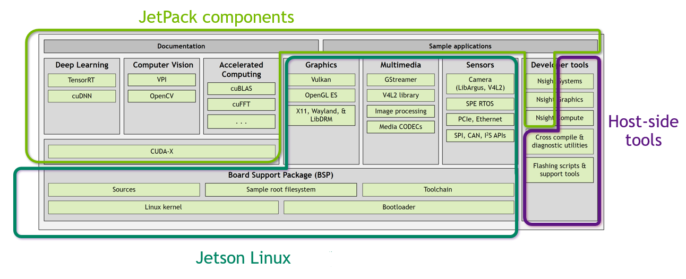
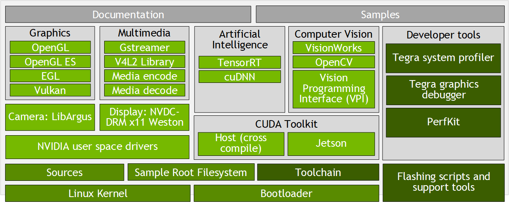

# Jetson 产品信息

## 1 Jetson Linux架构

Jetson Linux架构


L4T Software Stack


## 2 英文简写

| 缩写 | 详写                                                  |
| ---- | ----------------------------------------------------- |
| SOM  | System on Module                                      |
| BCT  | Boot Configuration Table                              |
|      |                                                       |
|      |                                                       |
| RCM  | Remote Control Management                             |
| VPR  | Video Protect Region                                  |
| DCB  | Display Configuration Blob, configure display outputs |
| MTS  | Multi Stream Transport                                |
| SPE  | Sensor Processing Engine                              |
| IVC  | Inter VM Communication                                |


## 3 Jetson modules 对比

|                                                                            | **Jetson AGX Orin series**                                                                                                                                                                                                                                     | **Jetson Orin NX series**                                                                                             | **Jetson Orin Nano series**                                                               | **Jetson AGX Xavier series**                                                                                            | **Jetson Xavier NX series**                                                                  | **Jetson TX2 series**                                                                                                                    | **Jetson Nano**                                                                            |                                                                                            |                                                                                            |                                                                 |                                                                                                                                                                            |                                            |                              |                              |                             |                   |                 |                               |
| -------------------------------------------------------------------------- | -------------------------------------------------------------------------------------------------------------------------------------------------------------------------------------------------------------------------------------------------------------- | --------------------------------------------------------------------------------------------------------------------- | ----------------------------------------------------------------------------------------- | ----------------------------------------------------------------------------------------------------------------------- | -------------------------------------------------------------------------------------------- | ---------------------------------------------------------------------------------------------------------------------------------------- | ------------------------------------------------------------------------------------------ | ------------------------------------------------------------------------------------------ | ------------------------------------------------------------------------------------------ | --------------------------------------------------------------- | -------------------------------------------------------------------------------------------------------------------------------------------------------------------------- | ------------------------------------------ | ---------------------------- | ---------------------------- | --------------------------- | ----------------- | --------------- | ----------------------------- |
| **Jetson AGX Orin Developer Kit**                                          | **Jetson AGX Orin 64GB**                                                                                                                                                                                                                                       | **Jetson AGX Orin 32GB**                                                                                              | **Jetson Orin NX 16GB**                                                                   | **Jetson Orin NX 8GB**                                                                                                  | **Jetson Orin Nano Developer Kit**                                                           | **Jetson Orin Nano 8GB**                                                                                                                 | **Jetson Orin Nano 4GB**                                                                   | **Jetson AGX Xavier Industrial**                                                           | **Jetson AGX Xavier 64GB**                                                                 | **Jetson AGX Xavier**                                           | **Jetson Xavier NX 16GB**                                                                                                                                                  | **Jetson Xavier NX**                       | **Jetson TX2i**              | **Jetson TX2**               | **Jetson TX2 4GB**          | **Jetson TX2 NX** | **Jetson Nano** | **Jetson Nano Developer Kit** |
| AI Performance                                                             | 275 TOPS                                                                                                                                                                                                                                                       | 200 TOPS                                                                                                              | 100 TOPS                                                                                  | 70 TOPS                                                                                                                 | 40 TOPS                                                                                      | 20 TOPS                                                                                                                                  | 30 TOPS                                                                                    | 32 TOPS                                                                                    | 21 TOPS                                                                                    | 1.26 TFLOPS                                                     | 1.33 TFLOPS                                                                                                                                                                | 472 GFLOPS                                 |                              |                              |                             |                   |                 |                               |
| GPU                                                                        | 2048-core NVIDIA Ampere architecture GPU with 64 Tensor Cores                                                                                                                                                                                                  | 1792-core NVIDIA Ampere architecture GPU with 56 Tensor Cores                                                         | 1024-core NVIDIA Ampere architecture GPU with 32 Tensor Cores                             | 1024-core NVIDIA Ampere architecture GPU with 32 Tensor Cores                                                           | 512-core NVIDIA Ampere architecture GPU with 16 Tensor Cores                                 | 512-core NVIDIA Volta architecture GPU with 64 Tensor Cores                                                                              | 384-core NVIDIA Volta™ architecture GPU with 48 Tensor Cores                               | 256-core NVIDIA Pascal™ architecture GPU                                                   | 128-core NVIDIA Maxwell™ architecture GPU                                                  |                                                                 |                                                                                                                                                                            |                                            |                              |                              |                             |                   |                 |                               |
| GPU Max Frequency                                                          | 1.3 GHz                                                                                                                                                                                                                                                        | 930 MHz                                                                                                               | 918 MHz                                                                                   | 765 MHz                                                                                                                 | 625 MHz                                                                                      | 1211 MHz                                                                                                                                 | 1377 MHz                                                                                   | 1100 MHz                                                                                   | 1.12GHz                                                                                    | 1.3 GHz                                                         | 921MHz                                                                                                                                                                     |                                            |                              |                              |                             |                   |                 |                               |
| CPU                                                                        | 12-core Arm® Cortex®-A78AE v8.2 64-bit CPU  3MB L2 + 6MB L3                                                                                                                                                                                                    | 8-core Arm® Cortex®-A78AE v8.2 64-bit CPU 2MB L2 + 4MB L3                                                             | 8-core Arm® Cortex®-A78AE v8.2 64-bit CPU  2MB L2 + 4MB L3                                | 6-core Arm® Cortex®-A78AE v8.2 64-bit CPU  1.5MB L2 + 4MB L3                                                            | 6-core Arm® Cortex®-A78AE v8.2 64-bit CPU  1.5MB L2 + 4MB L3                                 | 8-core NVIDIA Carmel Arm®v8.2 64-bit CPU  8MB L2 + 4MB L3                                                                                | 6-core NVIDIA Carmel Arm®v8.2 64-bit CPU  6MB L2 + 4MB L3                                  | Dual-core NVIDIA Denver™ 2 64-bit CPU and quad-core Arm® Cortex®-A57 MPCore processor      | Quad-core ARM® Cortex®-A57 MPCore processor                                                |                                                                 |                                                                                                                                                                            |                                            |                              |                              |                             |                   |                 |                               |
| CPU Max Frequency                                                          | 2.2 GHz                                                                                                                                                                                                                                                        | 2 GHz                                                                                                                 | 1.5 GHz                                                                                   | 2.0 GHz                                                                                                                 | 2.2 GHz                                                                                      | 1.9 GHz                                                                                                                                  | Denver2: 1.95 GHz  Cortex-A57: 1.92 GHz                                                    | Denver 2: 2 GHz  Cortex-A57: 2 GHz                                                         | 1.43GHz                                                                                    |                                                                 |                                                                                                                                                                            |                                            |                              |                              |                             |                   |                 |                               |
| [ DL Accelerator ](https://developer.nvidia.com/deep-learning-accelerator) | 2x NVDLA v2                                                                                                                                                                                                                                                    | 1x NVDLA v2                                                                                                           | -                                                                                         | 2x NVDLA                                                                                                                | 2x NVDLA                                                                                     | -                                                                                                                                        | -                                                                                          |                                                                                            |                                                                                            |                                                                 |                                                                                                                                                                            |                                            |                              |                              |                             |                   |                 |                               |
| DLA Max Frequency                                                          | 1.6 GHz                                                                                                                                                                                                                                                        | 1.4 GHz                                                                                                               | 614 MHz                                                                                   | -                                                                                                                       | 1.2 GHz                                                                                      | 1.4 GHz                                                                                                                                  | 1.1 GHz                                                                                    | -                                                                                          | -                                                                                          |                                                                 |                                                                                                                                                                            |                                            |                              |                              |                             |                   |                 |                               |
| Vision Accelerator                                                         | 1x PVA v2                                                                                                                                                                                                                                                      | -                                                                                                                     | 2x PVA                                                                                    | 2x PVA                                                                                                                  | -                                                                                            | -                                                                                                                                        |                                                                                            |                                                                                            |                                                                                            |                                                                 |                                                                                                                                                                            |                                            |                              |                              |                             |                   |                 |                               |
| Safety Cluster Engine                                                      | -                                                                                                                                                                                                                                                              | -                                                                                                                     | -                                                                                         | 2x Arm® Cortex®-R5 in lockstep                                                                                          | -                                                                                            | -                                                                                                                                        | -                                                                                          | -                                                                                          |                                                                                            |                                                                 |                                                                                                                                                                            |                                            |                              |                              |                             |                   |                 |                               |
| Memory                                                                     | 64GB 256-bit LPDDR5   204.8GB/s                                                                                                                                                                                                                                | 32GB 256-bit LPDDR5   204.8GB/s                                                                                       | 16GB 128-bit LPDDR5   102.4GB/s                                                           | 8GB 128-bit LPDDR5   102.4GB/s                                                                                          | 8GB 128-bit LPDDR5   68 GB/s                                                                 | 4GB 64-bit LPDDR5   34 GB/s                                                                                                              | 32GB 256-bit LPDDR4x (ECC support)   136.5GB/s                                             | 64GB 256-bit LPDDR4x  136.5GB/s                                                            | 32GB 256-bit LPDDR4x  136.5GB/s                                                            | 16GB 128-bit LPDDR4x  59.7GB/s                                  | 8GB 128-bit LPDDR4x  59.7GB/s                                                                                                                                              | 8GB 128-bit LPDDR4 (ECC Support)  51.2GB/s | 8GB 128-bit LPDDR4  59.7GB/s | 4GB 128-bit LPDDR4  51.2GB/s | 4GB 64-bit LPDDR4  25.6GB/s |                   |                 |                               |
| Storage                                                                    | 64GB eMMC 5.1                                                                                                                                                                                                                                                  | -  (Supports external NVMe)                                                                                           | -  (SD Card Slot & external NVMe via M.2 Key M)                                           | -  (Supports external NVMe)                                                                                             | 64GB eMMC 5.1                                                                                | 32GB eMMC 5.1                                                                                                                            | 16GB eMMC 5.1                                                                              | 32GB eMMC 5.1                                                                              | 16GB eMMC 5.1                                                                              | 16GB eMMC 5.1                                                   |                                                                                                                                                                            |                                            |                              |                              |                             |                   |                 |                               |
| Video Encode                                                               | 2x 4K60 (H.265)  4x 4K30 (H.265)  8x 1080p60 (H.265)  16x 1080p30 (H.265)                                                                                                                                                                                      | 1x 4K60 (H.265)  3x 4K30 (H.265)  6x 1080p60 (H.265)  12x 1080p30 (H.265)                                             | 1080p30 supported by 1-2 CPU cores                                                        | 2x 4K60 (H.265)  6x 4K30 (H.265)  12x 1080p60 (H.265)  24x 1080p30 (H.265)                                              | 4x 4K60 (H.265)  8x 4K30 (H.265)  16x 1080p60 (H.265)  32x 1080p30 (H.265)                   | 2x 4K60 (H.265)  4x 4K30 (H.265)  10x 1080p60 (H.265)  22x 1080p30 (H.265)                                                               | 1x 4K60 (H.265)  3x 4K30 (H.265)  4x 1080p60 (H.265)                                       | 1x 4K30 (H.265)  2x 1080p60 (H.265)                                                        |                                                                                            |                                                                 |                                                                                                                                                                            |                                            |                              |                              |                             |                   |                 |                               |
| Video Decode                                                               | 1x 8K30 (H.265)  3x 4K60 (H.265)  7x 4K30 (H.265)  11x 1080p60 (H.265)  22x 1080p30 (H.265)                                                                                                                                                                    | 1x 8K30 (H.265)  2x 4K60 (H.265)  4x 4K30 (H.265)  9x 1080p60 (H.265)  18x 1080p30 (H.265)                            | 1x 4K60 (H.265)  2x 4K30 (H.265)  5x 1080p60 (H.265)  11x 1080p30 (H.265)                 | 2x 8K30 (H.265)  4x 4K60 (H.265)  8x 4K30 (H.265)  18x 1080p60 (H.265)  36x 1080p30 (H.265)                             | 2x 8K30 (H.265)  6x 4K60 (H.265)  12x 4K30 (H.265)  26x 1080p60 (H.265)  52x 1080p30 (H.265) | 2x 8K30 (H.265)  6x 4K60 (H.265)  12x 4K30 (H.265)  22x 1080p60 (H.265)  44x 1080p30 (H.265)                                             | 2x 4K60 (H.265)  7x 1080p60 (H.265)  14x 1080p30 (H.265)                                   | 1x 4K60 (H.265)  4x 1080p60 (H.265)                                                        |                                                                                            |                                                                 |                                                                                                                                                                            |                                            |                              |                              |                             |                   |                 |                               |
| CSI Camera                                                                 | 16-lane MIPI CSI-2 connector                                                                                                                                                                                                                                   | Up to 6 cameras (16 via virtual channels)  16 lanes MIPI CSI-2  D-PHY 2.1 (up to 40Gbps) \| C-PHY 2.0 (up to 164Gbps) | Up to 4 cameras (8 via virtual channels***)  8 lanes MIPI CSI-2  D-PHY 2.1 (up to 20Gbps) | 2x MIPI CSI-2 22-pin Camera Connectors                                                                                  | Up to 4 cameras (8 via virtual channels***)  8 lanes MIPI CSI-2  D-PHY 2.1 (up to 20Gbps)    | Up to 6 cameras  (36 via virtual channels)  16 lanes MIPI CSI-2 \| 8 lanes SLVS-EC  D-PHY 1.2 (up to 40 Gbps)  C-PHY 1.1 (up to 62 Gbps) | Up to 6 cameras  (24 via virtual channels)  14 lanes MIPI CSI-2  D-PHY 1.2 (up to 30 Gbps) | Up to 6 cameras  (12 via virtual channels)  12 lanes MIPI CSI-2  D-PHY 1.2 (up to 30 Gbps) | Up to 5 cameras  (12 via virtual channels)  12 lanes MIPI CSI-2  D-PHY 1.1 (up to 30 Gbps) | Up to 4 cameras  12 lanes MIPI CSI-2  D-PHY 1.1 (up to 18 Gbps) | 2x 15-pin 2-lane MIPI CSI-2 camera connectors                                                                                                                              |                                            |                              |                              |                             |                   |                 |                               |
| PCIe*                                                                      | x16 PCIe slot supporting x8 PCIe Gen4  M.2 Key M slot with x4 PCIe Gen4  M.2 Key E slot with x1 PCIe Gen4                                                                                                                                                      | Up to 2 x8 + 1 x4 + 2 x1   (PCIe Gen4, Root Port, & Endpoint)                                                         | 1 x4 + 3 x1  (PCIe Gen4, Root Port, & Endpoint)                                           | M.2 Key M slot with x4 PCIe Gen3  M.2 Key M slot with x2 PCIe Gen3  M.2 Key E slot                                      | 1 x4 + 3 x1  (PCIe Gen3, Root Port, & Endpoint)                                              | 1 x8 + 1 x4 + 1 x2 + 2 x1  (PCIe Gen4, Root Port & Endpoint)                                                                             | 1 x4 (PCIe Gen4) + 1 x1 (PCIe Gen3)                                                        | up to 1 x1 + 1 x4 OR 1 x1 + 1 x1 + 1 x2  (PCIe Gen2)                                       | 1 x1 + 1 x2  (PCIe Gen2)                                                                   | 1 x4  (PCIe Gen2)                                               | x1 on the M.2 Key E                                                                                                                                                        |                                            |                              |                              |                             |                   |                 |                               |
| USB*                                                                       | USB Type-C connector: 2x USB 3.2 Gen2  USB Type-A connector: 2x USB 3.2 Gen2, 2x USB 3.2 Gen1   USB Micro-B connector: USB 2.0                                                                                                                                 | 3x USB 3.2 Gen2 (10 Gbps)  4x USB 2.0                                                                                 | 3x USB 3.2 Gen2 (10 Gbps)  3x USB 2.0                                                     | USB Type-A Connector: 4x USB 3.2 Gen2   USB Type-C Connector for UFP                                                    | 3x USB 3.2 Gen2 (10 Gbps)  3x USB 2.0                                                        | 3x USB 3.2 Gen2 (10 Gbps)  4x USB 2.0                                                                                                    | 1x USB 3.2 Gen2 (10 Gbps)  3x USB 2.0                                                      | up to 3x USB 3.0 (5 Gbps)  3x USB 2.0                                                      | 1x USB 3.0 (5 Gbps)  3x USB 2.0                                                            | 1x USB 3.0 (5 Gbps)  3x USB 2.0                                 | 4x USB 3.0 Type-A connectors   1x USB 2.0 Micro-B connector                                                                                                                |                                            |                              |                              |                             |                   |                 |                               |
| Networking*                                                                | RJ45 connector with up to 10 GbE                                                                                                                                                                                                                               | 1x GbE  1x 10GbE                                                                                                      | 1x GbE                                                                                    | 1xGbE Connector                                                                                                         | 1x GbE                                                                                       | 1x GbE                                                                                                                                   | 1x GbE                                                                                     | 1x GbE                                                                                     | 1x GbE, WLAN                                                                               | 1x GbE                                                          | 1x GbE                                                                                                                                                                     | Gigabit Ethernet, M.2 Key E                |                              |                              |                             |                   |                 |                               |
| Display                                                                    | 1x DisplayPort 1.4a (+MST) connector                                                                                                                                                                                                                           | 1x 8K60 multi-mode DP 1.4a (+MST)/eDP 1.4a/HDMI 2.1                                                                   | 1x 8K30 multi-mode DP 1.4a (+MST)/eDP 1.4a/HDMI 2.1                                       | 1x DisplayPort 1.2 (+MST) connector                                                                                     | 1x 4K30 multi-mode DP 1.2 (+MST)/eDP 1.4/HDMI 1.4**                                          | 3 multi-mode DP 1.4/eDP 1.4/HDMI 2.0                                                                                                     | 2 multi-mode DP 1.4/eDP 1.4/HDMI 2.0                                                       | 2 multi-mode DP 1.2/eDP 1.4/HDMI 2.0  2 x4 DSI (1.5Gbps/lane)                              | 2 multi-mode DP 1.2/eDP 1.4/HDMI 2.0  1x 2 DSI (1.5Gbps/lane)                              | 2 multi-mode DP 1.2/eDP 1.4/HDMI 2.0  1 x2 DSI (1.5Gbps/lane)   | 1x HDMI 2.0 Connector   1x DP 1.2 Connector                                                                                                                                |                                            |                              |                              |                             |                   |                 |                               |
| Other I/O                                                                  | 40-pin header (UART, SPI, I2S, I2C, CAN, PWM, DMIC, GPIO)  12-pin automation header  10-pin audio panel header  10-pin JTAG header  4-pin fan header  2-pin RTC batter backup connector  microSD slot  DC power jack  Power, Force Recovery, and Reset buttons | 4x UART, 3x SPI, 4x I2S, 8x I2C, 2x CAN, PWM, DMIC & DSPK, GPIOs                                                      | 3x UART, 2x SPI, 2x I2S, 4x I2C, 1x CAN, DMIC & DSPK, PWM, GPIOs                          | 40-Pin Expansion Header(UART, SPI, I2S, I2C, GPIO)  12-pin button header  4-pin fan header  microSD Slot  DC power jack | 3x UART, 2x SPI, 2x I2S, 4x I2C, 1x CAN, DMIC & DSPK, PWM, GPIOs                             | 5x UART, 3x SPI, 4x I2S, 8x I2C, 2x CAN, PWM, DMIC, GPIOs                                                                                | 3x UART, 2x SPI, 2x I2S, 4x I2C, 1x CAN, PWM, DMIC & DSPK, GPIOs                           | 5x UART, 3x SPI, 4x I2S, 8x I2C, 2x CAN, GPIOs                                             | 3x UART, 2x SPI, 4x I2S, 4x I2C, 1x CAN, GPIOs                                             | 3x UART, 2x SPI, 2x I2S, 4x I2C, GPIOs                          | 40-pin header (UART, SPI, I2S, I2C, PWM, GPIO)   12-pin automation header   4-pin fan header   4-pin POE header   DC power jack   Power, Force Recovery, and Reset buttons |                                            |                              |                              |                             |                   |                 |                               |
| Power                                                                      | 15W - 60W                                                                                                                                                                                                                                                      | 15W - 40W                                                                                                             | 10W - 25W                                                                                 | 10W - 20W                                                                                                               | 7W - 15W                                                                                     | 7W - 10W                                                                                                                                 | 20W - 40W                                                                                  | 10W - 30W                                                                                  | 10W - 20W                                                                                  | 10W - 20W                                                       | 7.5W - 15W                                                                                                                                                                 | 5W - 10W                                   |                              |                              |                             |                   |                 |                               |
| Mechanical                                                                 | 110mm x 110mm x 71.65mm  (Height includes feet, carrier board, module, and thermal solution)                                                                                                                                                                   | 100mm x 87mm  699-pin Molex Mirror Mezz Connector  Integrated Thermal Transfer Plate                                  | 69.6mm x 45mm  260-pin SO-DIMM connector                                                  | 100 mm x 79 mmx 21 mm  (Height includes feet, carrier board, module, and thermal solution)                              | 69.6mm x 45mm  260-pin SO-DIMM connector                                                     | 100mm x 87mm  699-pin connector  Integrated Thermal Transfer Plate                                                                       | 69.6mm x 45mm  260-pin SO-DIMM connector                                                   | 87mm x 50mm  400-pin connector  Integrated Thermal Transfer Plate                          | 69.6mm x 45mm  260-pin SO-DIMM connector                                                   | 69.6mm x 45mm  260-pin SO-DIMM connector                        | 100mm x 79mm x 30.21mm   (Height includes carrier board, module, and thermal solution)                                                                                     |                                            |                              |                              |                             |                   |                 |                               |

 †  The Jetson Nano and Jetson Xavier NX modules included as part of the  Jetson Nano developer kit and the Jetson Xavier NX developer kit have  slots for using microSD cards instead of eMMC as system storage devices.
 *USB 3.2, MGBE, and PCIe share UPHY Lanes. See the Product Design Guide for supported UPHY configurations.
 **See the Jetson Orin Nano Series Data Sheet for more details on additional compatibility to DP 1.4a and HDMI 2.1
 ***Virtual Channels for Jetson Orin NX and Jetson Orin Nano are subject to change
 Refer to the Software Features section of the latest NVIDIA Jetson Linux Developer Guide for a list of supported features.


## 4 Jetson Linux 35.4.1

- Adds support for Jetson AGX Orin Industrial module
- Bootloader
  - Support for [Grub as OS Loader in UEFI](https://docs.nvidia.com/jetson/archives/r35.4.1/DeveloperGuide/text/SD/Bootloader/UEFI.html#grub-support)
  - Support for [PXE boot](https://docs.nvidia.com/jetson/archives/r35.4.1/DeveloperGuide/text/SD/FlashingSupport.html#configuring-a-pxe-boot-server-for-uefi-bootloader-on-jetson)
- Camera:
  - Enhanced error resiliency for improved stability in Argus
  - Support for multiple camera synchronization (sample argus_syncstereo added)
  - Deskew calibration support for high data rate sensors (> 1.5 Gbps)
  - Support for alternating exposures in Argus (sample argus_userAlternatingAutoexposure added)
- Multimedia:
  - NvBuf
- Security:
  - Support for up to [3 signing keys to sign bootloader](https://docs.nvidia.com/jetson/archives/r35.4.1/DeveloperGuide/text/SD/Security/SecureBoot.html#revocation-of-the-pkc-keys) in secure boot and ability to revoke the keys
  - Ability to add and revoke UEFI signing keys
  - Enhanced secure boot for [encrypting kernel, kernel-dtb and initrd](https://docs.nvidia.com/jetson/archives/r35.4.1/DeveloperGuide/text/SD/Security/SecureBoot.html#sd-security-secureboot-uefipayloadencryption)
  - Support for [signing kernel modules](https://docs.nvidia.com/jetson/archives/r35.4.1/DeveloperGuide/text/SD/Security/SecureBoot.html#kernel-module-signing)
  - Support for delegated authentication with ability to [sign UEFI with platform vendor owned keys](https://docs.nvidia.com/jetson/archives/r35.4.1/DeveloperGuide/text/SD/Security/SecureBoot.html#uefi-platform-vendor-key-feature)
  - Support in disk encryption for [encrypting only User Data Partition (UDA)](https://docs.nvidia.com/jetson/archives/r35.4.1/DeveloperGuide/text/SD/Security/DiskEncryption.html#enabling-disk-encryption-only-for-uda) and [runtime enabling encryption of UDA partitions](https://docs.nvidia.com/jetson/archives/r35.4.1/DeveloperGuide/text/SD/Security/DiskEncryption.html#enabling-disk-encryption-for-dynamically-created-partitions)
- Over The Air Updates:
  - Support for Jetson Orin NX and Jetson Orin Nano in [Image based OTA](https://docs.nvidia.com/jetson/archives/r35.4.1/DeveloperGuide/text/SD/SoftwarePackagesAndTheUpdateMechanism.html#updating-jetson-linux-with-image-based-over-the-air-update) tools

## 5 OS内模组查询

```bash
i2cdump -y 0 0x50
```

```shell
# 截取部分
No size specified (using byte-data access)
     0  1  2  3  4  5  6  7  8  9  a  b  c  d  e  f    0123456789abcdef
00: 02 00 fe 00 00 00 00 00 00 00 00 00 00 00 00 00    ?.?.............
10: 00 00 00 0a 36 39 39 2d 31 33 37 30 31 2d 30 30    ...?699-13701-00
20: 30 34 2d 35 30 30 20 47 2e 30 00 00 00 00 00 00    04-500 G.0......
```

20行 `04-500 G.0` 代表

| 参数 | 含义                                                                        |
| ---- | --------------------------------------------------------------------------- |
| 04   | Jetson AGX Orin 32G 模组，00为Jetson AGX Orin，05为Jetson AGX Orin 64G 模组 |
| 500  | version number                                                              |
| G.0  | manufacturing version                                                       |

更多含义参考[官方文档](https://docs.nvidia.com/jetson/archives/r35.2.1/DeveloperGuide/text/HR/JetsonEepromLayout.html#jetson-eeprom-layout)。

## 6 Jetson模组及配置

| Module                                | Module Type | Carrier Board                                         | Configuration             | Configuration Notes                                                          |
| ------------------------------------- | ----------- | ----------------------------------------------------- | ------------------------- | ---------------------------------------------------------------------------- |
| Jetson Orin NX 16GB-DRAM (P3767-0000) | Production  | Jetson Orin Nano reference carrier board (P3768-0000) | `jetson-orin-nano-devkit` | Flashes QSPI-NOR and USB/NVMe drive (only supported via l4t_initrd_flash.sh) |
| Jetson Orin NX 8GB-DRAM (P3767-0001) | Production | Jetson Orin Nano reference carrier board (P3768-0000) | `jetson-orin-nano-devkit` | Flashes QSPI-NOR and USB/NVMe drive (only supported via l4t_initrd_flash.sh) |
| Jetson Orin Nano 8GB-DRAM (P3767-0003) | Production | Jetson Orin Nano reference carrier board (P3768-0000) | `jetson-orin-nano-devkit` | Flashes QSPI-NOR and USB/NVMe drive (only supported via l4t_initrd_flash.sh) |
| Jetson Orin Nano 4GB-DRAM (P3767-0004) | Production | Jetson Orin Nano reference carrier board (P3768-0000) | `jetson-orin-nano-devkit` | Flashes QSPI-NOR and USB/NVMe drive (only supported via l4t_initrd_flash.sh) |
| Jetson Orin Nano 8GB-DRAM (P3767-0005) | Development | Jetson Orin Nano reference carrier board (P3768-0000) | `jetson-orin-nano-devkit` | Flashes QSPI-NOR and microSD Card/USB/NVMe drive (only supported via l4t_initrd_flash.sh) |
| Jetson AGX Orin Dev-Kit Module (P3701-0000) | Development | Jetson AGX Orin reference carrier board (P3737-0000) | `jetson-agx-orin-devkit` | Flashes QSPI-NOR and eMMC |
| Jetson AGX Orin 32GB-DRAM (P3701-0004) | Production | Jetson AGX Orin reference carrier board (P3737-0000) | `jetson-agx-orin-devkit` | Flashes QSPI-NOR and eMMC |
| Jetson AGX Orin 64GB-DRAM (P3701-0005) | Production | Jetson AGX Orin reference carrier board (P3737-0000) | `jetson-agx-orin-devkit` | Flashes QSPI-NOR and eMMC |
| Jetson AGX Orin Industrial (P3701-0008) | Production | Jetson AGX Orin reference carrier board (P3737-0000) | `jetson-agx-orin-devkit-industrial` | Flashes QSPI-NOR and eMMC |

对于上面显示的每个配置，都有一个扩展名为.conf的对应文件。例如，`jetson-orin-nano-devkit`的配置文件为`jetson-orin-nano-devkit.conf`。

## 7 Recovery模式下模组的代号

显示内容：

```shell
Bus xxx Device yyy: ID 0955:zzzz NVIDIA Corp. APX
# xxx - 总线号
# yyy - 设备号
# zzz - 模组代号
```

模组代号：

| 代号 | 模组 |
| ---- | ---- |
| 7023 | Jetson AGX Orin (`P3701-0000 with 32GB` & `P3701-0005 with 64GB` & `P3701-0008 with 64GB`) |
| 7223 | Jetson AGX Orin (`P3701-0004 with 32GB`) |
| 7323 | Jetson Orin NX (`P3767-0000 with 16GB`) |
| 7423 | Jetson Orin NX (`P3767-0001 with 8GB`) |
| 7523 | Jetson Orin Nano (`P3767-0003` & `P3767-0005 with 8GB`) |
| 7623 | Jetson Orin Nano (`P3767-0004 with 4GB`) |
| 7019 | Jetson AGX Xavier (`P2888-0001 with 16GB` & `P2888-0004 with 32GB` & `P2888-0005 with 64GB`) & Jetson AGX Xavier Industrial (`P2888-0008`) |
| 7e19 | Jetson Xavier NX (`P3668`) |

## 8 Cold Boot 和 RCM Boot

在嵌入式系统（例如 NVIDIA Jetson 平台）的启动过程中，**Cold Boot** 和 **RCM Boot** 是两种常见的启动模式，各自适用于不同的情景和需求。以下是它们的详细解释：

---

### **Cold Boot (冷启动)**
1. **定义**:
   - Cold Boot 是设备的标准启动模式，即从设备的主存储（如 eMMC、SD 卡、UFS）加载操作系统并正常运行。
   - 通常发生在设备上电或硬件复位时。

2. **启动过程**:
   - 设备从片上引导只读存储器（Boot ROM）开始。
   - Boot ROM 加载并执行存储介质中的引导加载程序（如 U-Boot 或 CBoot）。
   - 最终加载操作系统内核（Linux）。

3. **使用场景**:
   - 正常的设备启动。
   - 不需要特殊调试或固件更新的情况下。

4. **优点**:
   - 快速且自动化。
   - 适合生产环境。

---

### **RCM Boot (Recovery Mode Boot, 恢复模式启动)**
1. **定义**:
   - RCM Boot 是一种特殊启动模式，用于在设备固件损坏、需要刷机或需要调试时手动干预启动过程。
   - "RCM" 即 **Recovery Mode**，设备在此模式下不会加载主存储的操作系统，而是等待外部设备通过 USB 向其提供指令或固件。

2. **启动过程**:
   - 上电或复位时，通过特定的按键组合（或信号）将设备置于 RCM 模式。
   - 设备会停留在 Boot ROM 中并等待通过 USB 接收引导数据（例如，使用工具 `nvflash` 或 `SDK Manager`）。
   - 在 RCM 模式下，设备通常可通过外部工具加载临时固件、刷写新的引导程序或系统镜像。

3. **使用场景**:
   - 固件更新（例如，重新烧录 Jetson 的 BSP 镜像）。
   - 恢复因主存储损坏而无法启动的设备。
   - 调试引导问题或进行低级别开发。

4. **优点**:
   - 提供设备恢复的能力。
   - 允许在主存储不可用时通过 USB 与主机通信。

5. **进入 RCM 模式的方式**:
   - 通常通过按住特定的硬件按键（如 **Force Recovery 按键**）并同时重启设备来进入。
   - 设备会通过 USB 端口向主机暴露一个 RCM 设备。

---

### **Cold Boot 和 RCM Boot 的区别对比**

| **特性**           | **Cold Boot**                                   | **RCM Boot**                                   |
|---------------------|------------------------------------------------|-----------------------------------------------|
| **用途**           | 正常启动操作系统                               | 恢复设备、调试或固件更新                      |
| **引导来源**       | 主存储（如 eMMC、UFS 或 SD 卡）                | 外部主机通过 USB 提供引导文件                 |
| **启动过程**       | 自动完成，无需外部干预                         | 需用户操作进入恢复模式                       |
| **用户交互**       | 无需用户干预                                   | 用户通过 USB 和主机工具进行操作              |
| **典型工具**       | 不需要额外工具                                 | `SDK Manager` 或 `nvflash` 等工具            |
| **适用场景**       | 正常使用和生产环境                             | 固件更新、主存储损坏修复、低级调试            |

---

### **如何区分设备处于 Cold Boot 或 RCM Boot 模式**
1. **观察设备状态**:
   - Cold Boot：设备会直接加载操作系统，并通过串口或屏幕显示启动日志。
   - RCM Boot：设备通常不会显示任何启动日志，但通过 USB 可以识别为 RCM 设备。

2. **检查 USB 连接**:
   - 在 RCM 模式下，连接设备到主机后，运行以下命令可以确认是否处于 RCM 模式：
     ```bash
     lsusb
     ```
     输出类似以下信息：
     ```
     Bus 001 Device 005: ID 0955:7321 NVidia Corp.
     ```

---

### **总结**
- **Cold Boot** 是设备的正常启动模式，主要用于加载和运行操作系统。
- **RCM Boot** 是一种特殊模式，用于恢复和调试设备，在嵌入式开发和生产过程中至关重要。

