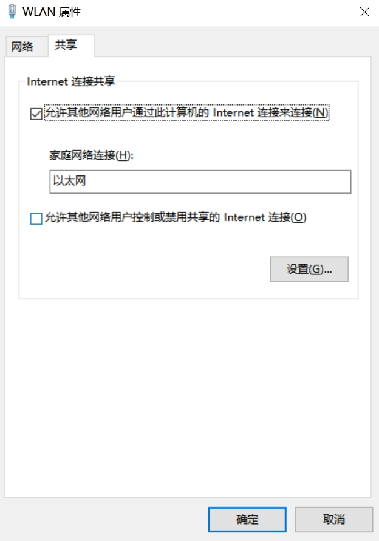

# Windows
## 1. 软件推荐

- [readcat 电子书](https://github.com/read-cat/read-cat/releases)


## 2. 改键位
1. win + R 输入 `regedit` 打开注册表编辑器
2. 找到 `HKEY_LOCAL_MACHINE\SYSTEM\CurrentControlSet\Control\Keyboard Layout`，右键->新建->二进制值，重命名为 `Scancode Map`
3. 打开这个文件，前8组00是版本号和头部字节，不用动。接下来4组表示映射数，如图所示，我填写为03 00 00 00。其中“03”表示有两组映射。若要映射多组，只需增加相应的值即可，如映射3组为"04"，映射5组为"06"，其最小为值为“02”，表示只映射一组。再后边每4组数据代表一个映射，每一个映射格式如下：A B，B映射为A，也就是说，我们按下B键，则相当于按下了原来的A键。

   > 注意：在注册表中输入时，需要将扫描码的高低字节交换
4. `Capslock` 与 左侧`Ctrl`交换的映射为（从第 2 行开始）：
   ```shell
   03 00 00 00 3A 00 1D 00
   1D 00 3A 00 00 00 00 00
   ```
5. 重启电脑生效

## 3. Office2021

1. 下载部署工具 [office tool plus](https://otp.landian.vip/zh-cn/)，解压缩后运行 `Office Tool Plus.exe`；

2. 卸载已安装版本；

3. 主页选择“部署”进入部署界面；

4. 选择：基础设置>产品>“添加产品”>“**Office 专业增强版2021-批量版**”；

5. 在“应用程序”中选择自己需要安装的组件，比如Word、Excel、PowerPoint、Viso等；

6. 然后在“语言”中添加自己的语言，比如“简体中文”；

7. 接下来在“激活设置”中输入激活密钥，并且勾选“自动激活”选项;

   **T3N47-WVHW9-VCT2V-QKP29-P393W** (Office2021)

   **M9N3Y-CCB6D-J66FD-KKGF4-8B799** (Viso2021)

   **2NYG6-3BBBX-M97JW-B7DFV-G6RMB** (Project2021)

8. 通道选择“**Office2021企业长期版**”；

9. 部署模式选择“安装”;

10. 最后点击上方的“**开始部署**”。

## 4. 安装系统时出现“Windows 无法安装到这个磁盘”
### 4.1 原因
win8/ windows10系统均添加快速启动功能，预装的win8/windows10电脑默认都是UEFI引导和GPT硬盘。
传统的引导方式为Legacy引导和MBR硬盘，UEFI必须跟GPT对应，同理Legacy必须跟MBR对应。
如果BIOS开启UEFI，而硬盘分区表格式为MBR则无法安装；BIOS关闭UEFI而硬盘分区表格式为GPT也是无法安装Windows。

| 开机引导方式  | 存储数据的结构 |
| -- | -- |
| Legacy | MBR |
| UEFI | GPT |

### 4.2 处理方法
**1.转换硬盘格式**

a.在当前安装界面按住【Shift】+【F10】调出命令提示符窗口；

b.输入【diskpart】，按回车执行;

c.进入DISKPART命令模式，输入【list disk】回车，列出当前磁盘信息；

d.要转换磁盘0格式，则输入【select disk 0】回车，输入【clean】，删除磁盘分区；

e.输入【convert gpt】则转为GPT；或者输入【convert MBR】 转换为 MBR格式；

f.最后输入两次 【exit】 回车退出命令提示符，返回安装界面继续安装系统。

**2.修改启动引导项**

可以在主板设置选项里面改，根据需要改引导方式为UEFI引导或Legacy引导

## 5 Outlook点击超链接“您的组织策略阻止我们为您完成此操作“

**原因**

之前安装了其它三方的浏览器，并且设置为了默认浏览器，后来卸载了该浏览器，再在Office里面打开超链接时，由于Office是按照默认浏览器打开的。这个默认浏览器是之前设置的，而删除了该三方的浏览器后，才会出现这个报错的。

**解决方法**

1）按 `Win+R`，输入 `regedit`，打开注册表编辑器，定位到`HKEY_CURRENT_USER\Software\Classes\.html`。在默认项上点右键，选择修改，将`Htmlfile`粘贴到输入框。（Chrome浏览器设置为 `ChromeHTML`，可以在`HKEY_LOCAL_MACHINE\SOFTWARE\Classes\.html\OpenWithProgids`中查看浏览器名称）

2）再定位到 `HKEY_CURRENT_USER\Software\Classes\.htm`。在默认项上点右键，选择修改，将 `Htmlfile` 粘贴到输入框。(Chrome浏览器设置为 `ChromeHTML`)

## 6 ubuntu 使用 WPS

使用前修改权限

```bash
sudo chmod 0777 -R  /opt/kingsoft/wps-office
rm -rf  ~/.config/Kingsoft/
```

[下载字体](https://pan.baidu.com/s/1bFmSqWVDxc7Kc4kbJt3uEQ)（提取玛：m5jw）并安装

```bash
cd 下载/usr/share/fonts/wps_symbol_fonts
sudo mv * /usr/share/fonts
sudo mkfontscale
sudo mkfontdir
sudo fc-cache
```
## 7 windows笔记本通过网线共享网络

前提：windows笔记本正常上网，假设网卡为wlan

打开 `控制面板\网络和 Internet\网络和共享中心`，选择`更改适配器设置`，右键WLAN，选择属性->共享



笔记本的IP一般为 `192.168.137.1`，如果共享设备是ubuntu，需要修改`/etc/systemd/resolved.conf`,

```shell
[Resolve]
DNS=223.5.5.5
#FallbackDNS=
#Domains=
LLMNR=no
#MulticastDNS=no
#DNSSEC=no
#DNSOverTLS=no
#Cache=no-negative
#DNSStubListener=yes
#ReadEtcHosts=yes
```
重启`systemd-resolved`服务生效，不要直接修改`/etc/resolved.conf`，此文件受前者控制。
