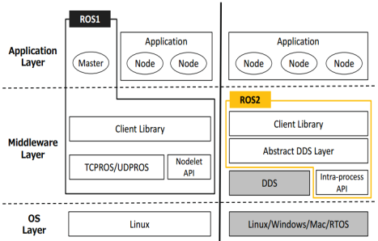
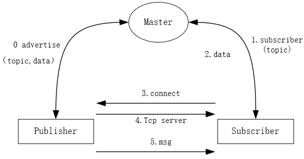
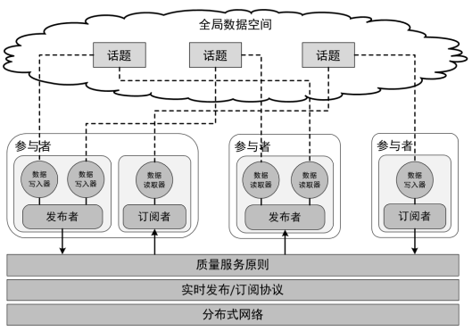

# ROS2

- [Github源码](https://github.com/ros2)
- [navigation2 repository](https://index.ros.org/r/navigation2/)
- [**ROS2 官方文档**](http://docs.ros.org/en/galactic/index.html)
- [ROS Wiki](http://wiki.ros.org/)
- [ROS2 官方教程](http://wiki.ros.org/ROS2/Tutorials)
- [colcon文档](https://colcon.readthedocs.io/en/released/)
- [[ROS Index]](https://index.ros.org/)


- [ROS2 V4L2 驱动](https://github.com/tier4/ros2_v4l2_camera)
- [ROS2 opencv 驱动](https://github.com/clydemcqueen/opencv_cam)

- [Issac ROS](https://nvidia-isaac-ros.github.io/index.html)

## 1 常用命令

```bash
# node
$ ros2 node list               # 查看节点列表
$ ros2 node info <node_name>   # 查看节点信息
# topic
$ ros2 topic list                # 查看话题列表
$ ros2 topic info <topic_name>   # 查看话题信息
$ ros2 topic hz <topic_name>     # 查看话题发布频率
$ ros2 topic bw <topic_name>     # 查看话题传输带宽
$ ros2 topic echo <topic_name>   # 查看话题数据
$ ros2 topic pub <topic_name> <msg_type> <msg_data>   # 发布话题消息
# service
$ ros2 service list                  # 查看服务列表
$ ros2 service type <service_name>   # 查看服务数据类型
$ ros2 service call <service_name> <service_type> <service_data>   # 发送服务请求
# interface
$ ros2 interface list                    # 查看系统接口列表
$ ros2 interface show <interface_name>   # 查看某个接口的详细定义
$ ros2 interface package <package_name>  # 查看某个功能包中的接口定义
# action
$ ros2 action list                  # 查看服务列表
$ ros2 action info <action_name>    # 查看服务数据类型
$ ros2 action send_goal <action_name> <action_type> <action_data>   # 发送服务请求
# parameter
$ ros2 param list
$ ros2 param describe turtlesim background_b   # 查看某个参数的描述信息
$ ros2 param get turtlesim background_b        # 查询某个参数的值
$ ros2 param set turtlesim background_b 10     # 修改某个参数的值
$ ros2 param dump turtlesim >> turtlesim.yaml  # 将某个节点的参数保存到参数文件中
$ ros2 param load turtlesim turtlesim.yaml     # 一次性加载某一个文件中的所有参数
# build
$ rosdepc install -y --from-paths src --ignore-src --rosdistro $ROS_DISTRO
$ colcon build --symlink-install --continue-on-error --cmake-args -DCMAKE_BUILD_TYPE=Release
```

fishros工具

```bash
# 安装ROS/ROS2解决ROSDEP安装docker等
wget http://fishros.com/install -O fishros && bash fishros
```


测试

```shell
ros2 run demo_nodes_cpp talker
ros2 run demo_nodes_cpp listener
```
## 3 ROS2 && ROS

### 3.1 ROS 优点

- 通信机制
- 开发工具
- 应用功能
- 生态系统

### 3.2 ROS 缺点

- **多机器人系统**-没有构建多机器人系统的标准方法
- **跨平台**-无法适用于Windows/RTOS等系统
- **实时性**-缺少实时性方面的设计
- **网络连接**-需要良好的网络环境保证数据的完整性
- **产品化**-从科学研究到消费产品的过渡欠佳
- **项目管理**-无法胜任完整生命周期下项目管理

### 3.4 ROS2 改变

1. 架构的颠覆
   - ROS1的架构下，所有节点需要使用Master节点进行管理
   - ROS2使用基于DDS的Discovery机制
2. API的重新设计
   - ROS1中的大部分代码基于2009年设计的API
   - ROS2重新设计用户API，使用方法类似
3. 编译系统的升级
   - ROS1使用catkin管理项目
   - ROS2使用ament进行编译引导，colcon进行编译

## 4 架构对比



| 对比项   | 不同点                                          |
| :------- | :---------------------------------------------- |
| OS       | ROS1：Linux<br />ROS2：Linux/Windows/Mac/RTOS   |
| 通讯     | ROS1：TCPROS/UDPROS<br />ROS2：DDS              |
| 节点模型 | ROS1：subscriber/publisher<br />ROS2：Discovery |
| 进程     | ROS1：Nodelet<br />ROS2：Intra-process          |

ROS2开发重点

- 通信机制（轻）
- 开发工具（重）
- 应用功能（重）
- 生态系统（重）

由于ROS2使用DDS进行通信，开发者可以把更多的精力放在其他开发工作方面。

## 5 ROS2通信机制DDS

### 5.1 参考资料

[DDS的开发动机](http://design.ros2.org/articles/ros_on_dds.html)

[eProsima的实现Fast RTPS  ](https://www.eprosima.com/index.php/products-all/eprosima-fast-dds)

[RTI的Connext](https://www.rti.com/blog/ros2-dds-when-ecosystems-merge?utm_term=rti%20dds&utm_campaign=DDS_INTL_MSROI&utm_source=adwords&utm_medium=ppc&hsa_net=adwords&hsa_tgt=kwd-390689499727&hsa_ad=425606229834&hsa_acc=4872307840&hsa_grp=103082731390&hsa_mt=p&hsa_cam=9632840626&hsa_kw=rti%20dds&hsa_ver=3&hsa_src=g&gclid=Cj0KCQiA7oyNBhDiARIsADtGRZZk1yM4CiszrcSVgwfxpur9FC4BOQkFbi2MLtZ0XUAkEEsOeGbWhWkaAjZ4EALw_wcB)

[RCL的API文档](https://docs.ros2.org/beta1/api/rcl/)

### 5.2 DDS概述及其特点

DDS(Data Distribution Service，数据分发服务)技术核心是以数据为核心的发布/订阅模型(Data-Centric Publish-Subscribe ，DCPS)，这种DCPS模型创建了-一个“全域数据空间”(global data space)的概念，所有独立的应用都可以访问。

#### 5.2.1 ROS1的通信模型



- ROS Master启动
- Publisher注册
- Subscriber注册
- ROS Master进行信息匹配
- Subscriber发送连接请求
- Publisher确认连接请求
- 建立网络连接
- Publisher向Subscriber发布数据

#### 5.2.2 ROS2通信模型

DDS是ROS2通信的中间件，默认的供应商是RTI公司的Connext，若需要其他供应商的DDS，可以自行配置。



- 参与者（Domain Participant）
  - 一个参与者Participant就是一个容器，对应于一个使用DDS的用户，任何DDS的用户都必须通过Participant访问全局数据空间
- 发布者（Publisher）
  - 数据发布的执行者，支持多种数据类型的发布，可以与多个数据写入器（DataWriter）相联，发布一种或多种主题（Topic）的消息
- 订阅者（Subscriber）
  - 数据订阅的执行者，支持多种数据类型的订阅，可以与多个数据读取器（DataReader）相联，订阅一种或多种主题的消息
- 数据写入器（DataWriter）
  - 应用向发布者更新数据的对象，每个数据写入器对应一个特定的Topic，类似于ROS1中的一个消息发布者
- 数据读取器（DataReader）
  - 应用从订阅者读取数据的对象，每个数据读取器对应一个特定的Topic，类似于ROS1中的一个消息订阅者
- 主题（Topic）
  - 与ROS1中的概念一致，包含一个话题名称和一种数据结构
- Qos（Quality of Service）
  - 服务质量原则，控制各方面与底层的通讯机制，主要从时间限制、可靠性、持续性、历史记录等方面，满足用户针对不同场景的数据应用需求

#### 5.2.3 DDS的核心价值

- 分散式架构和时空解耦
- 可进化性和可扩展性
- 稳定可靠的通信
- 关键任务和业务取向
- 容错和冗余
- 即插即用及互操作性

#### 5.2.4 Qos质量服务原则

- 历史(History)
  - Keep last：只存储最多N个样本， 通过队列深度设置
  - Keep all: 存储所有样本， 由底层中间件的资源大小限制

- 深度 (Depth)
  - 队列的大小： 只有在和Kepp last一起时才会起作用
- 可靠性 (Reliability)
  - 最高效率： 尝试发送数据， 但是在网络不好的情况下有可能丢包
  - 高可靠性: 保证数据发送成功， 但是可能会重试发送多次
- 耐久力 (Durability)
  - 本地缓存(Transient local): 发送者会为还未加入的节点保存未接收的数据
  - 自动挥发(Volatile): 不会特意保存数据

### 5.3 DDS在ROS2中的使用

目前ROS2所有版本默认使用的[Fast DDS](https://github.com/ros2/rmw_fastrtps)，其与ROS2 stack的接口是有中间件供应商eProsima提供的。

如果对实时性要求特别高，这必须使用静态 DDS API 从源代码构建。目前唯一支持的实现是RTI提供的 **Connext**。相关操作见具体文档。

## 6 ROS2的编译系统

### 6.1 参考资料

ROS 2 在Bouncy之前的发行版，使用的编译工具是`ament_tools`，之后是`colcon`。ROS2支持多平台，以下代码示例基于Ubuntu的平台。

[ament-make使用文档](https://docs.ros.org/en/galactic/How-To-Guides/Ament-CMake-Documentation.html)

[Cmake使用文档](https://cmake.org/cmake/help/v3.2/command/find_package.html#command:find_package)

[ROS2API文档](https://docs.ros2.org/ardent/api/rclcpp/index.html)

[lifecycle的使用](https://github.com/ros2/demos/blob/master/lifecycle/README.rst)

### 6.2 CMakeLists.txt 和 package.xml 的不同

```cmake
cmake_minimum_required(VERSION 3.5)
project(ros2_demo)

# 缺省版本 C++14
if(NOT CMAKE_CXX_STANDARD)
    set(CMAKE_CXX_STANDARD 14)
endif()

# 查找库
find_package(ament_cmake REQUIRED)
find_package(rclcpp REQUIRED)
find_package(std_msgs REQUIRED)
find_package(example_interfaces REQUIRED)
# 查找依赖文件
add_executable(ros2_talker src/ros2_talker.cpp)
# 链接库
# 用于代替传统的target_link_libraries
ament_target_dependencies(ros2_talker rclcpp std_msgs)

# 注册 导出库文件
install(TARGETS
    ros2_talker # 告诉ros2有这么个目标（可执行文件或者库）
    DESTINATION lib/${PROJECT_NAME}
)
# 宏，安装package.xml
ament_package()
```

```xml
<buildtool_depend>ament_cmake</buildtool_depend>

    <buildtool_depend>rosidl_default_generators</buildtool_depend>
	<!-- 客户端库 -->
    <build_depend>rcl</build_depend>
	<!-- 中间件 -->
    <build_depend>rmw_implementation</build_depend>

    <exec_depend>rcl</exec_depend>
    <exec_depend>rmw_implementation</exec_depend>
    <exec_depend>rosidl_default_runtime</exec_depend>
```

### 6.2 语法的不同

支持C++14/C++17，使用了大量的auto/智能指针/Lambda函数等语法，充分发挥C++的高效

Python默认版本Python3

注释是基于ROS1的实现API

```c++
int main(int argc, char ** argv)
{
    //ros::init(argc, argv, "add_two_ints_client");
    rclcpp::init(argc, argv);

    //ros::NodeHandle n;
    auto node = rclcpp::Node::make_shared("add_two_ints_client");

    //ros::ServiceClient client = n.serviceClient<beginner_tutorials::AddTwoInts>("add_two_ints");
    auto topic = std::string("add_two_ints");
    auto client = node->create_client<example_interfaces::srv::AddTwoInts>(topic);

    //beginner_tutorials::AddTwoInts srv;
    auto request = std::make_shared<example_interfaces::srv::AddTwoInts::Request>();
    request->a = 2;
    request->b = 3;

    while (!client->wait_for_service(1s)) {
        if (!rclcpp::ok()) {
            RCLCPP_ERROR(node->get_logger(), "Interrupted while waiting for the service. Exiting.")
            return 0;
        }
        RCLCPP_INFO(node->get_logger(), "service not available, waiting again...")
    }

    //client.call(srv)
    auto result = send_request(node, client, request);
    if (result) {
        RCLCPP_INFO(node->get_logger(), "Result of add_two_ints: %zd", result->sum)
    } else {
        RCLCPP_ERROR(node->get_logger(), "Interrupted while waiting for response. Exiting.")
    }

    rclcpp::shutdown();
    return 0;
}
```

```python
# python节点程序没有CMakeLists.txt,且需要手动编写package.xml
import rclpy
from rclpy.node import Node
from std_msgs.msg import String


class MinimalPublisher(Node): # 继承Node类,构造函数

    def __init__(self):
        # 调用Node类的构造函数，节点命名
        super().__init__('minimal_publisher')
        # 生命发布的节点类型，话题，队列长度
        # 队列长度（Qos的必要设置），若订阅者接受消息的速度慢，则限制队列消息的长度
        self.publisher_ = self.create_publisher(String, 'topic', 10)
        # 回调计时器
        timer_period = 0.5  # seconds
        # 创建一条附加计数器值的消息，并将其发布到控制台 get_logger().info
        self.timer = self.create_timer(timer_period, self.timer_callback)
        # self.i 是计数器
        self.i = 0

    def timer_callback(self):
        msg = String()
        msg.data = 'Hello World: %d' % self.i
        self.publisher_.publish(msg)
        self.get_logger().info('Publishing: "%s"' % msg.data)
        self.i += 1


def main(args=None):
    # rclpy库初始化，创建节点
    rclpy.init(args=args)

    minimal_publisher = MinimalPublisher()

    rclpy.spin(minimal_publisher)

    # Destroy the node explicitly
    # (optional - otherwise it will be done automatically
    # when the garbage collector destroys the node object)
    minimal_publisher.destroy_node()
    rclpy.shutdown()


if __name__ == '__main__':
    main()
```

对于关心的参数还可以使用C++编写监测参数的节点进行监测， ParameterEventHandler 是一种监视参数更改的便捷方式。

### 6.3 编译

#### 6.3.1 colcon简介

ament_cmake 不支持 `devel `空间的概念，并且需要包安装，colcon支持` --symlink-install` 选项。这允许通过更改` source `空间中的文件来更改`install`已安装的文件，以便更快地进行迭代（例如Python文件或其他未编译的资源），。

`colcon build --symlink-install`

```bash
.
├── build 存储中间文件
├── install 每个包安装的位置，默认每个包安装到单独子目录
├── log colcon调用的各种日志信息
└── src
```

colcon默认生成build/install/log目录，与`catkin`相比，没有`devel`目录。

#### 6.3.2 创建自己的功能包

colcon 支持多种构建类型。 推荐的构建类型是 `ament_cmake`和 `ament_python`. 也支持纯 `cmake`包。

例如， `ament_python`build 是 [ament_index_python 包 ](https://github.com/ament/ament_index/tree/master/ament_index_python)，其中 setup.py 是构建的主要入口点。

而 [demo_nodes_cpp 之类 ](https://github.com/ros2/demos/tree/master/demo_nodes_cpp)使用 `ament_cmake`构建类型，并使用 CMake 作为构建工具。

为方便起见，使用该工具 `ros2 pkg create`基于模板创建新包（相当于ROS1中的`catkin_create_package`）。

在ROS2中`roscd`弃用，取而代之的是`colcon_cd`。根据colcon文档，需要先在`.bashrc`文件中进行相应设置。

如果不想构建特定的包，建立一个名为 `COLCON_IGNORE`的空文件，里面的包不会被索引，类似于Git中的`.gitignore`文件。

如果想避免在 CMake 包中配置和构建测试： `--cmake-args -DBUILD_TESTING=0`.

如果要从包运行单个特定测试： `colcon test --packages-select YOUR_PKG_NAME --ctest-args -R YOUR_TEST_IN_PKG`。

## 7 tf2和URDF

### 7.1 tf2

[tf2论文](https://ieeexplore.ieee.org/abstract/document/6556373)

[tf2基础教程](https://docs.ros.org/en/galactic/Tutorials/Tf2/Tf2-Main.html)

[tf2中级教程](https://docs.ros.org/en/galactic/Tutorials/Tf2/Learning-About-Tf2-And-Time-Py.html)

[tf2高级教程](https://docs.ros.org/en/galactic/Tutorials/Tf2/Time-Travel-With-Tf2-Cpp.html)

基础教程是完成基本的功能：监听转换和广播转换。监听是接收和缓冲系统中广播的所有坐标系，并查询坐标系之间的特定变换。  广播是将坐标系的相对位姿发送到系统，一个系统可以有多个广播器，每个广播器都提供机器人不同部分的信息。静态转换可以节省存储和查找时间，相关节点的编写方法在教程中都有涉及。

中级教程中使用`lookup_transform`监听不可靠网络和不可忽略延时的发布源的不同速率的转换时特别有用。

高级教程介绍tf2的强大之处：`the time travel`。简单来说，传输的数据包含时间和空间信息，可以完成各种任务，例如让一个机器人跟踪完成另一个机器人的动作。

### 7.2 URDF

使用`XML`构建视觉机器人和可移动以及人模型，并向URDF模型添加物理属性和碰撞属性，以及URDF文件的使用方法和清理方法。

## 8 开发ROS2功能包

### 8.1 参考资料

[C++功能包开发文档](https://docs.ros.org/en/galactic/How-To-Guides/Ament-CMake-Documentation.html)

[Python功能包开发文档](https://docs.ros.org/en/galactic/How-To-Guides/Ament-CMake-Python-Documentation.html)

[C++标准库内存分配器](https://en.cppreference.com/w/cpp/memory/allocator_traits)

[TLSF内存分配器](https://github.com/ros2/realtime_support/tree/master/tlsf_cpp)

### 8.1 C++功能包和Python功能包

在第6部分已经简单介绍过相关的文件编写，需要注意的是Python包中要有`setup.py`（相当于C++包中的`CMakeLists.txt`）和`setup.cfg`。

`ament_cmake_python`是包含 Python 代码的的包，为`ament_cmake`构建类型提供 CMake 函数。


```bash
# 项目结构
.
└── my_project
    ├── CMakeLists.txt
    ├── package.xml
    └── my_project
        ├── __init__.py
        └── my_script.py
```

在`package.xml`中需要声明依赖

`<buildtool_depend>ament_cmake_python</buildtool_depend>`

在CMakelists.txt中需要包含

```xml
find_package(ament_cmake_python REQUIRED)
ament_python_install_package(${PROJECT_NAME})
```

### 8.2 自定义接口

虽然ROS2重用已有的标准消息和服务定义， 然而在很多情况下你还是要自己定义消息或者服务。

自定义消息和服务第一步时创建` .msg `或` .srv `文件。为了方便起见，` .msg `文件放置于软件包文件夹下的`msg`文件夹内。 `.srv `文件放置于`srv`文件夹内。
在写完` .msg`或 `.srv `文件后， 在的`CmakeLists.txt`文件内添加一些代码。 使得代码生成程序能够处理你的定义文件。

注：ROS1中的自定义消息和服务可以直接放到ROS2的代码架构中使用。

ROS2中新增的功能有三个：

- bounded arrays，指定数组长度，节省空间

  ```python
  int32[] foo
  int32[5] bar
  int32[<5] bat
  ```

- bounded strings，可以支持有长度限制的字符串

- default value，支持默认值，相当于C++构造函数的变量初始化

### 8.3 内存分配器的编写

#### 8.3.1 需要解决的问题

使用 new 来实时分配内存时可能造成的危险，很多标准的C++库数据结构在数据增加的时候都会自动分配内存 ，例如`std::vector`，它会使用自己的内存分配器而不是系统的内存分配器，他可以是一个已经提前分配好的栈，更适合实时运行程序。

ROS2 C++客户端程序(rclcpp)与C++标准库有着类似的原则。 发布者订阅者和执行者接受一个内存分配器参数，这个分配器在运行时控制着整个程序。

#### 8.3.2 自己编写内存分配器

为了写一个和ROS2接口兼容的内存分配器， 必须兼容C++标准库的内存分配器接口。
C++标准库提供了一个叫做 `allocator_traits` 的东西，只需要实现很少的几个方法就可以按照标准的方式去分配和回收内存。 `allocator_traits` 是一个通用的结构， 它提供了通过通用内存分配器编写一个内存分配器所需要的其他参数。

写完内存分配器之后，必须把它通过一个共享指针传递给指配的发布者，订阅者和执行者，简单示例：

 ```c++
auto alloc = std::make_shared<MyAllocator<void>>();
auto publisher = node->create_publisher<:msg::UInt32>("allocator_example", 10, alloc);
auto msg_mem_strat =
    std::make_shared<rclcpp::message_memory_strategy::MessageMemoryStrategy< :msg::UInt32,MyAllocator<>>>(alloc);
auto subscriber = node->create_subscription< :msg::UInt32>("allocator_example", 10, callback, nullptr, false, msg_mem_strat,alloc);
std::shared_ptr< :memory_strategy::MemoryStrategy> memory_strategy = std::make_shared<AllocatorMemoryStrategy<MyAllocator<>>>(alloc);
rclcpp::executors::SingleThreadedExecutor executor(memory_strategy);
 ```

添加`executor`后，可以在主函数里调用：

```c++
uint32_t i = 0;
while (rclcpp::ok()) {
	msg->data = i;
	i++;
	publisher->publish(msg);
    rclcpp::utilities::sleep_for(std::chrono::milliseconds(1));
	executor.spin_some();
}
```

具体内存分配器的声明和实现函数的编写可以参考**8.1**中的文档。

使用**进程内管理器**可以在同一个进程中的发布者和订阅者之间传递内存分配器，可以通过`rcl context`实现，如果没有自定义的内存分配器，会使用默认的`new`。

通过自定义内存分配器的`allocate`和`deallocate`的调用次数观察是否被使用。

#### 8.3.3 TLSF

ROS2 针对实时性提供了TLSF（两层分离适应） 内存分配器的支持，参考资料里有详细的示例程序，TSLF是基于dual-GPL/LGPL协议的。